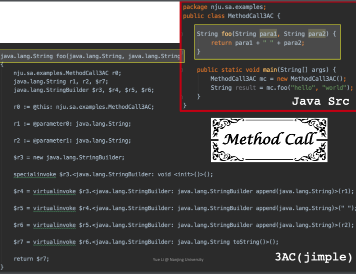

## 1. Compilers and Static Analyzers

编译器是一个软件，分为前端和后端两部分，将源代码生成机器码。编译器的前端一般由词法分析，语法分析，语义分析组成，词法分析是将源程序分成一个一个的token，也就是说，需要将字符串流（源程序）切分成一个个小的单元，划分出是关键字还是标识符还是运算符等等，一般用正则表达式来定义规则。语法分析就是将一个个的Token组成句子，它的功能比较受限，但是也能检测出一些错误出来，比如`f(a,b,)`这样子的错误，在此阶段构造出AST。语义分析会进行类型检查，构造出修饰后的AST。
而后端一般分为代码生成和优化相关的操作。那么静态分析和编译器的关系是什么呢？如下图所示，在生成了源代码的中间表示之后可以用静态分析来对代码进行一系列的操作。

## 2. AST vs IR
AST是抽象语法树(Abstract Syntax Tree)的缩写，IR是中间表示(Intermediate Representation)的缩写。

一个简单的例子如下图所示：

那么为什么静态分析在IR的层面上而不是在AST上面呢？

* IR相比于AST更底层，更接近于机器码，而AST更接近于语法结构。
* IR相比于AST，与语言的关联性更低。
* AST相比于IR会缺少控制流信息，同时IR也会更紧凑

## 3. IR: Three-Address Code (3AC)
三地址码（3AC）是一种IR，因为在一条指令最多含有3个地址，所以我们称这样的表示方法为3地址码。

## 4. 3AC in Real Static Analyzer

JVM提供了多种方法调用指令,举例分析下面四种：
* `invokestatic`：该指令用于调用静态方法，即使用 static 关键字修饰的方法；
* `invokespecial`：该指令用于三种场景：调用实例构造方法，调用私有方法（即private关键字修饰的方法）和父类方法（即super关键字调用的方法）；
* `invokeinterface`：do some interface implementation checking
* `invokevirtual`：call instance method

## 5. Static Single Assignment (SSA)

SSA：每一个被赋值的变量的名字都不一样

## 6. Basic Blocks (BB)

## 7. Control Flow Graphs (CFG)

