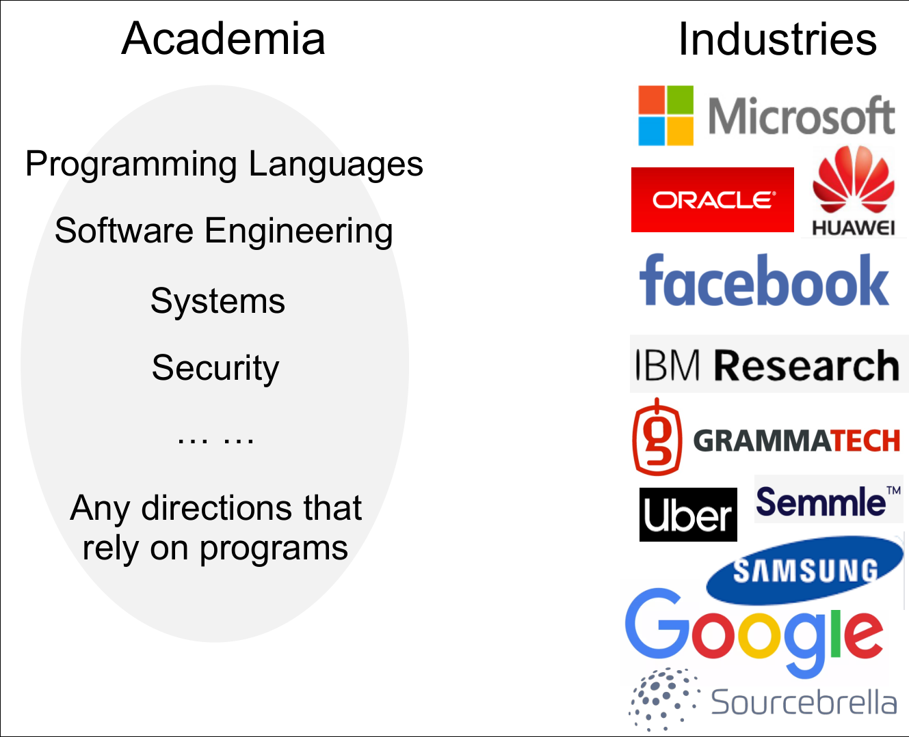
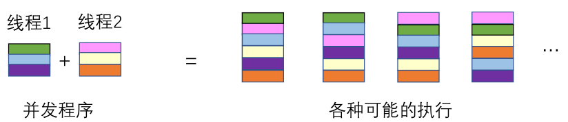

# 简介

## 简介

Getting started with static program analysis. Read this and start writing your first static program analyzer! We focus on the problem:

> ❓ How to automatically and efficiently guarantee software quality

静态程序分析入门。阅读此书并着手编写你的第一个静态程序分析器吧！本仓库关注一个非常重要的问题：

> ❓ 如何自动化地高效保障软件质量

* [《静态程序分析》Gitbook在线阅读地址](https://ranger-nju.gitbook.io/static-program-analysis-book/)
  * 有时gitbook需要科学上网才能访问，没法科学上网的小伙伴可以试试访问[这里](https://spa-book.pblo.gq/)。
* [《静态程序分析》GitHub项目地址](https://github.com/RangerNJU/Static-Program-Analysis-Book)
* 离线阅读方式
  1. 将本仓库**下载**到本地（安装Git后，在命令行中执行命令`git clone https://github.com/RangerNJU/Static-Program-Analysis-Book.git`）
  2. 周期性地**更新**，在仓库目录下执行`git pull`
  3. 使用[Typora](https://typora.io/)等本地Markdown阅读器**阅读**

### 表达你的声音 👂

* **批评的意见很有价值。** 这是我第一次书写教程，一定有很多做得不好的地方。如果你觉得有值得修改或值得讨论的地方（包括但不仅限于行文风格，内容准确性，图例与解释的易读性等等），可以选择：
* 加入QQ群（951182704）匿名或实名表达你的意见与看法
* 提issue
* 通过邮箱联系我（ranger.nju\#gmail.com\)
  * 如果你觉得我写得不错，可以到GitHub仓库中给我一个Star，也可以在自己的社交圈子中宣传，让更多的人了解这个项目。

### 更新记录与里程碑事件

1. Oct, 2020. 设立Repo，一个月内解锁Star、Fork和PR。
2. Nov. 将IR与Data Flow Analysis的相关内容暂时移出仓库，更新七至十课——Interprocedural Analysis、Pointer Analysis-Introduction and Foundations。
3. Dec. 更新十一和十二两课——Context Sensitive Pointer Analysis，指针分析大结局。🥳 更新十三十四课介绍指针分析的安全应用Taint Analysis和使用Datalog实现声明式指针分析算法。 更新十五十六课介绍IFDS分析框架和Soundiness。

图文的主体部分更新完毕，撒花~！

后续会考虑录制一些视频补充对动态例子的讲解。

## 这一《静态程序分析》教程对谁有用？

学生，开发者，研究者……几乎所有当代生活者都能从中受益。

* 学习方向与程序有关的**学生。** 
  * 计算机方向的学生可以通过深入学习这一领域知识而为自己建立独特的学术和就业优势，也能加深对编程的理解以降低自己写出bug的频率。
  * 其他方向的学生既然已经开始阅读这一页面，想必对计算机方向的内容有一定兴趣。你可以通过了解这一技术，了解静态分析软件（包括其内置于编译器，集成开发环境的部分）能够为你提供怎样的功能和便利，以及如何更好地使用这些软件，以此保证你所关心的程序质量。
* 工作内容与程序有关的**开发者。** 
  * 无论你希望更好地理解[Wiki](https://en.wikipedia.org/wiki/List_of_tools_for_static_code_analysis)上众多的开源或是闭源的静态程序分析技术，还是希望自己开发一个适用于眼下工作内容的静态程序分析器以保证程序质量，了解静态程序分析都会有所帮助。
* 研究领域与程序相关的**研究者。** 或许你希望微调研究方向，却因没有合适的入门材料而苦恼；或许你希望了解计算机领域的相关知识以期获得启发……这一教程可以作为你的入门材料或是闲暇读物。
* 生活与程序相关的**每个人**
  * 软件质量是信息化时代的重要议题之一，在这个时代生活与工作，你一定会遇到相关的问题。
  * 在大多数学校和企业中，没有开设该领域的课程。

## 什么是静态程序分析？

### 静态程序分析在计算机科学领域中的定位

**静态程序分析**是**编程语言**中**应用**层面下的一个细分领域，它是一个非常重要的核心内容。

在理论部分，考虑的是如何设计一个语言的语法和语义，如何设计语言的类型系统等等问题；有了语言的语法、语义和类型系统之后，我们需要支撑语言的运行。因此，在环境部分，需要考虑如何为运行中的程序提供运行时环境——如何设计编译器，在运行时需要怎样的支持（如内存的分配管理）等等；应用部分则关注如何保证语言所写出程序的效率、安全性和可靠性，主要考虑如何对程序进行分析，验证和合成（如何自动合成一个程序）。

#### 编程语言的分类

当今的计算机世界，面对这样一条恶龙： 👇

> 数十年来语言的核心没有变化，但软件的规模和复杂性增长迅速，如何保证程序的可靠性？

尽管新的语言和特性层出不穷，但现在编程语言无非三大类 _\(如果你对其中的某个语言不熟悉，可以到语言的官网或英文Wiki页面查看相关示例，也可以利用搜索引擎做初步的了解。本教程内容主要关注于针对命令式语言JAVA的分析。\)_ ：

* 命令式（C、C++、JAVA）
* 函数式（[Scala](https://www.scala-lang.org/)、[Haskell](https://www.haskell.org/)）
* 逻辑式（[Prolog](https://en.wikipedia.org/wiki/Prolog)）

### 静态程序分析的应用

静态程序分析即是屠龙的宝刀之一，举例来说这一技术可以处理以下问题\(_以下概念只需要了解，重要的应用在后文中会详细讲解。_\)：

1. 提高程序可靠性
   * Null pointer dereference, memory leak, etc.
   * 空指针引用与内存泄漏等：几乎每个程序编写者都被这两个问题所困扰过
2. 提高程序安全性
   * Private information leak, injection attack, etc.
   * 隐私信息泄漏：这一问题在移动应用中较为普遍，如果你感兴趣，可以参考[这篇论文](https://www.ieee-security.org/TC/SP2012/posters/ScanDal.pdf)。
   * [注入攻击](https://en.wikipedia.org/wiki/Code_injection)：这是网络安全中非常常见的议题。不熟悉的读者可以查看[W3School](https://www.w3schools.com/sql/sql_injection.asp)或[Wiki](https://en.wikipedia.org/wiki/SQL_injection)上关于SQL注入攻击的例子。
3. 为编译优化提供基础技术
   * Dead code elimination, code motion, etc.
   * [死代码消除](https://en.wikipedia.org/wiki/Dead_code_elimination)：在编译器的机器无关优化环节，将不会对程序执行结果产生影响的代码（即死代码）删除。
   * [循环不变量的代码移动](https://en.wikipedia.org/wiki/Loop-invariant_code_motion)：在编译器的机器无关优化环节，在保证不影响程序执行结果的情况下，将循环中的特定语句移动到循环外，使得程序运行时执行的语句数减少。更为详细的解释可以参考[StackOverFlow上的回答](https://stackoverflow.com/questions/5607762/what-does-code-motion-mean-for-loop-invariant-code-motion)。
4. 有助于程序理解
   * IDE call hierarchy, type indication, etc.
   * 为集成开发环境的功能提供帮助：当你使用VS/Idea/Clion/Eclipse/Android Studio等等IDE时，将鼠标悬停在代码上，IDE能够动态地分析并提示你所悬停对象的相关信息，背后使用的技术就是静态程序分析。

此外，静态程序分析技术也可以分析多线程程序，这是一个有难度的研究领域。主要困难在于处理多线程间的interleaving。本书定位入门，不会涉及相关内容。

### 静态程序分析的市场

* 在学术界，静态程序分析技术几乎可以应用于所有关于程序的研究方向。
* 在工业界，国外的Google，IBM等大企业已经初步建立了自己的静态程序分析团队。国内的华为和阿里等企业也正在积极寻找静态程序分析方面的人才。
* **无论你将来想在学术界还是工业界深入发展，学习这一领域的知识都能为你建立独特的优势。**

### 静态程序分析与类似技术的对比

> Testing shows the presence, not the absence of bugs. --Edsger W. Dijkstra

动态的软件测试和形式化语义的验证的作用与静态程序分析类似，这一部分对这三个细分方向做简单的对比。

#### 静态程序分析

* 优点：在选定的精度下能够保证没有bug。这在教程中会详细介绍。
* 缺点：
  1. 学术门槛相对高。目前国内高校只有北京大学和南京大学开设有关课程，且暂无教材。作为一门计算机专业的高年级选修课，入门和提高都较困难。
  2. You tell me.

#### 动态软件测试

* 优点：在工程中被广泛应用，并且有效。实现简单，便于自动化。
* 缺点：
  1. **无法保证没有bug。** 这是无法遍历所有可能的程序输入的必然结果。
  2. 在当今的由多核与网络应用带来的**并发环境下作用有限。** 某个bug可能只在特定情况下发生，因而难以稳定地复现。如果你对并发程序的动态测试细节感兴趣，可以参考[《拧龙头法测试并发程序》](https://zhuanlan.zhihu.com/p/51341151)。（截图来自南京大学《形式化语义》课程资料）

#### 形式化语义验证

* 优点：由于用数学的方法对程序做了抽象，能够保证没有bug。
* 缺点：
  1. 学术门槛较高，学习者必须有良好的数学基础才能入门。
  2. 验证代价较高，一般来说非常重要的项目会使用这一方式保证程序质量。甚至在操作系统这样重要的软件中，也并不一定会使用。\(截图来自鸿蒙OS直播发布会\)

## 加入项目/How to contribute

> 觉得有所帮助的话可以点个star支持哦。

欢迎希望添加更好的讲解资料或对教程内容进行扩充的小伙伴 `fork, modify, PR` 三连。

**提醒：引用图片时请使用相对路径。**

## 本地化/Localization

We'd love help translating this book! Open a new issue to start working on a new language. Feel free to start :\)

## 其他相关项目

### 软件质量保障相关

[《软件测试简介》Gitbook在线阅读地址](https://ranger-nju.gitbook.io/software-testing-intro)

[《软件测试简介》GitHub项目地址](https://github.com/RangerNJU/Software-Testing-Intro)

### 前辈们写过的优秀笔记

[适合预习和同步阅读，CSDN+简书](https://blog.csdn.net/panhewu9919/article/details/106007155)

[适合复习，个人博客笔记](https://fancypei.github.io/SA/)

## 进一步学习的资料

### 课程视频和阅读资料

- 北大熊英飞老师的《软件分析技术》课程视频公开在了[这里](https://liveclass.org.cn/cloudCourse/#/courseDetail/8mI06L2eRqk8GcsW)。
- CMU Jonathan Aldrich老师的[《17-355/17-665/17-819 Program Analysis》(2019 Spring)](https://www.cs.cmu.edu/~aldrich/courses/17-355-19sp/)。
- Anders Møller and Michael I. Schwartzbach的《lecture notes on Static Program analysis》

### 开源软件

- [Pysonar2的GitHub Repo](https://github.com/yinwang0/pysonar2)
