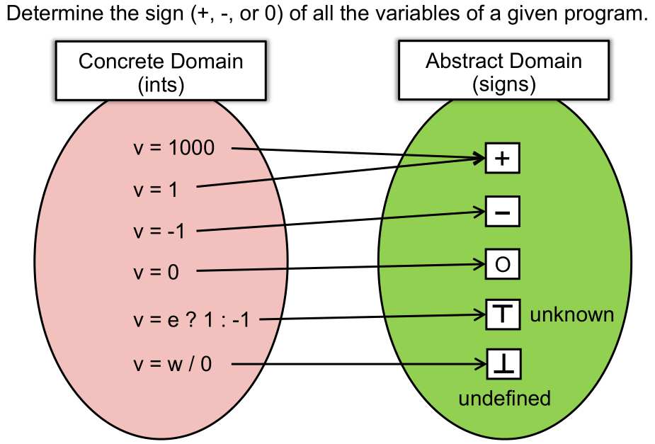

# 初见——静态分析是什么？

> 静态程序分析是指**不编译**出二进制代码通过测试用例对程序进行测试，仅通过**静态地**分析程序得到程序**不平凡**的性质的过程。

## 静态程序分析的抽象定义与诠释

### 定义

> Static analysis analyzes a program P to reason about its behaviors and determines whether it satisfies some properties before running P.

-   Does P contain any private information leaks?
-   Does P dereference any null pointers?
-   Are all the cast operations in P safe?
-   Can v1 and v2 in P point to the same memory location?
-   Will certain assert statements in P fail?
-   Is this piece of code in P dead (so that it could be eliminated)?

即：对一个程序P，静态程序分析在运行P之前分析它的行为并确认它是否满足某些性质。例如：

-   P会导致隐私信息泄漏吗？
-   P中会不会有空指针被解引用？
-   P中的所有cast操作（掌握JAVA或C++的读者应该熟悉这一操作）都是安全的吗？
-   P中的两个指针是否会指向同一个内存地址？
-   P中某个特定的断言会失败吗？
-   P中的某部分代码是死代码吗？

### 诠释

> Ensure \(or get close to\) soundness, while making good trade-offs between analysis precision and analysis speed.

在分析精度和速度之间做平衡的同时，保证（或近似）soundness。*（对于soundness这个词，有很多种不同的翻译方式，如可靠性、安全性等。）*通常来说，分析的精度要求越高，分析的速度就会越慢。类似的trade-off在计算机世界非常常见。

## 静态程序分析的具体解释

静态程序分析技术中最重要的两个技术，分别是Abstraction（抽象）和Over-Approximation（过近似）

### Abstraction



**抽象是将值从Concrete Domain（具体域）映射到Abstract Domain（抽象域）的过程，也即<u>将具体值映射为抽象值</u>。**

例如，在上图中：

-   Concrete Domain中变量的值可以是具体的数值，也可能是某种表达式或函数的返回值。
-   Abstract Domain中变量的值分为五类：
    1.  正
    2.  负
    3.  零
    4.  unknown（未知），通常表达为正的T，读作top
    5.  undefined（未定），通常表达为上下颠倒的T，读作bottom

关于unknown和undefined：

-   unknown（未知）：根据表达式或函数返回决定，程序运行时会有具体的正负零数值，但运行前只通过该表达式无法确定。如应用C语言中的三目运算符（TODO：加Link）`x = flag ? 1 : -1`中x的值就是unknown的。
-   undefined（未定）程序运行时会遇到错误，并产生未定义行为（TODO：加Link）。如许多语言中divided by zero（除数为零）通常会触发异常/硬件错误，此时如`a=b/0`中a的值就是undefined的。

### Over-approximation

**过近似主要是指对抽象值进行操作时的思想。**

继续上面的例子，具体来说操作可以分为两类：Data flow（数据流）和Control flow（控制流）：

#### Data flow

（TODO-加图）

* 两个正数相加为正数
* ...
* 正数和负数相加，结果为unknown/top。**这是因为运行前只知道表达式的正负号，无法确定结果是正负零中的任何一个，但程序运行时会有具体的数值。**
* unknown/top除以0，结果为undefined。**这是因为会触发未定义行为。**

#### Control flow

在程序执行过程中往往会有分支结构，如果x的值在两个分支中分别被赋抽象正值和抽象负值，那么合并时x抽象值应该是五类中的哪一种呢？

对于分支合并时的x，**运行前只知道抽象值的正负号，无法确定结果是哪一种，但程序运行时会有具体的数值**。无论是抽象为正还是负都无法准确描述x合并后的状态，所以x合并后的抽象值是unknown/top。

## Rice‘s Theorem与静态程序分析目标

### Rice's Theorem

> Any non-trivial property of the behavior of programs in a r.e. language is undecidable. （TODO：加中文）

（TODO：加中文） 这句话中有很多很难的词汇，接下来一一解释：

* non-trivial properties ~= interesting properties ~= the properties related with run-time behaviors of programs
* r.e. \(recursively enumerable\) 递归可枚举语⾔: recognizable by a Turing-machine
* There is no such approach to determine whether P satisfies such non-trivial properties, i.e., giving exact answer: Yes or No
* 故不存在 perfect \(sound & complete\) static analysis

### 两个重要概念：Sound与Complete

> 思考： 作为一个开发者，你使用静态分析器分析自己的代码时，哪种情况更让你觉得糟糕？
>
> * 静态分析器**没有分析出代码错误**的部分。
> * 静态分析器**判断代码正确的部分为错**的部分。

Over- and under-approximations are both for safety of analysis.

sound: 报出所有问题 may analysis: outputs information that may be true \(over-approximation\) \(safe=over\)

complete: 报出的问题都是对的 must analysis: outputs information that must be true \(under-approximation\) \(safe=under\)

### 实际应用中静态分析器的设计目标

（TODO：加图） **实际应用中往往没有办法做到完美。因而需要妥协。**

需要静态分析器能在可接受的时间内给出精度满足要求的解。为此：

妥协 soundness \(false negatives 可能漏报\)

妥协 completeness \(false positives 可能误报\) \(⼤多数情况的分析，因为 soundness 很重要\)

## 再讲五块钱的？

### 关于未定义行为

-   TODO 加Link

-   一个经典的未定义行为例子：

    ```c++
    int a[7];
    	...
    int j = 0;
    
    //输出结果根据编译器实现不同而不同
    std::cout << a[j++] + a[j]	
    ```

### 关于trade-off

-   存储器层次结构：cache-memory-disk-network的经典结构，正是当代计算机设计者们对价格、读写速度和存储容量的典型trade-off。
-   段页式内存管理：分段和分页方式的存储管理各有其特点，而段页式存储管理将两种方式结合，优缺点互补。

### 关于判定问题中经常用到的术语

