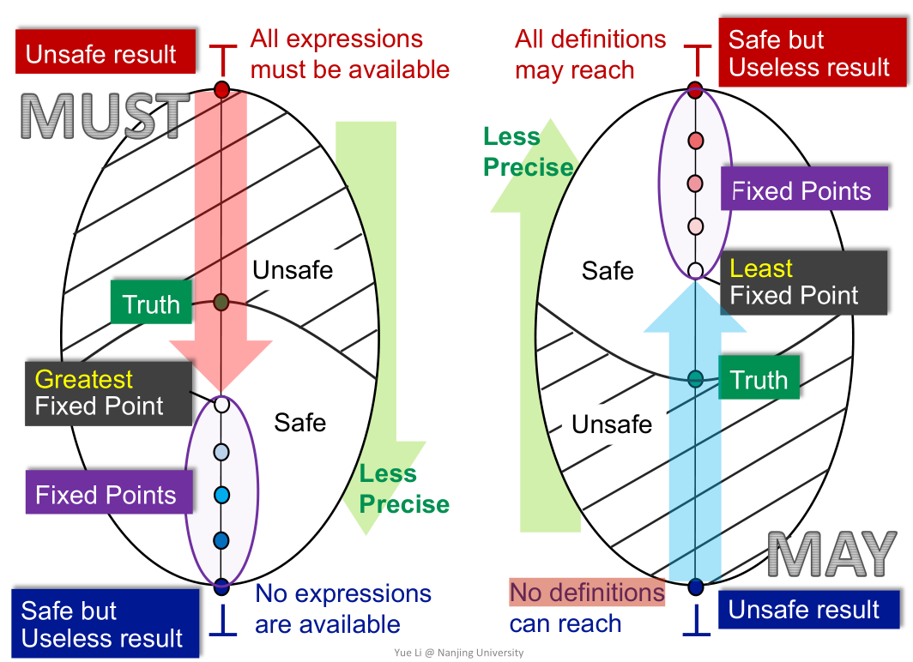

# 第三章-数据流分析——理论 

帮助理解之前所数的数据流分析技术，让你在将来review的时候更有效率。忘记了也能自己推导出大概。

## 基础（Recall离散数学）

### Yet Another(Math Instead of Program) View to Iterative Algorithm

Forward:根据IN求OUT
May:Merge时求并，初始化为bottom

文字描述->符号化描述。

*下标：Node，上标：迭代次数。最后i和i+1的结果一致。*

右下角引出不动点（数学定义）。

-   有解性（一定有解）
-   解的唯一性（假设取得了最好的）
    -   最大最小不动点？
-   什么时候算法给出解？

**这是数十年来程序分析的问题精华。接下来我们接触一些必要的数学。**

偏序： (能够容忍不可比较性)

用例子记忆。

poset（偏序集）

-   自反
-   反对称
-   传递

Lattice（格）之图。

正式介绍Lattice之前，介绍两个概念：上下界。

注意：*上下界不需要是集合S中的元素。*

例子。

定义一个least upper bound(lub or join)，即最小上界。类似地定义最大下界。

例子。

属性：
1.  join和meet不一定有。
2.  有则唯一。（ 证明-反证法。）

定义Lattice： 任取两个元素，都有join和meet就是lattice。

定义Semilattice：join和meet有且只有一个。

定义Complete Lattice：任何一个子集都有join和meet。

top和bottom。

性质：有穷则complete，反之不行（Recall Ex1）

程序通常是有限的（表达式，变量等是有限的）。因此，在数据流分析中主要关注Complete Lattice。

定义Product Lattice：新的集合，新的关系和join和meet。

性质：

1.  A product lattice is a lattice
2.  If a product lattice L is a product of complete lattices, then L is also complete

Lattice上数据流分析的框架：

例子。

总结：Data flow analysis can be seen as iteratively applying transfer functions and meet/join operations on the values of a lattice.

基础已备。回顾开头的三个问题：

回顾单调性（和高中数学定义一致）。

**不动点定理**

前提： Complete Lattice/Function is Monotonic/Lattice is Finite.

效果：给出了固定的求不动点的方法。

证明：
1.  存在
2.  最小

存在-f(bottom)中的元素一定在L中，由bottom的定义，这个式子自然成立。 *微积分：单调有界必收敛。*

最小-从bottom开始和从任意一个x开始都满足关系。

#### 喜闻乐见的五块钱

从PL与数学的证明（T的不同方向）讲起。

通过清晰地定义问题的相关因素，缩小问题。

1.  重新定义问题的Scope（上下文敏感指针分析可以跑得必非上下文敏感指针分析更快）。
2.  科研任务/工作任务需要通过沟通缩小Scope。

### Relate Iterative Algorithm to Fixed-Point Theorem

上节课的Product Lattice。

Transfer Function**应该被设计为**是单调的。
join和meet都可以被证明是单调的。

回答问题：
1.  Yes。因为不动点原理。
2. Yes。因为推理出来...

何时能达到不动点？
首先定义高度。

提示：每个node一次一步，一个node最坏情况下走h步。所有node最坏情况下要走$h*k$步。

所以算法快慢与程序的规模和Lattice Domain有关。

### May and Must Analyses, a Lattice View

相当于总结上文。
TODO：从前三节课程的理解到一张图解释

所有分析过程一定从不安全的结果向安全但没有意义的结果推进，
以reaching definition为例子，每个块被初始化为全0，代表没有definition可以reach到特定程序点。
Truth的位置在Safe和Unsafe中间，越接近Safe，精度就越低。

问题：为什么一定能越过Truth达到Fixed Point呢？
是否Safe是由Transfer Function和Mering的策略决定的，也就是由设计算法的人决定的。

### Meet/Join-Over-All-Paths Solution(MOP)

>   我们的结论有多准？

Meet：一旦数据流汇聚了，如何处理？

PL基础小知识：
程序中的汇聚从何而来？<-分支和循环结构
-   分支：if,switch,try catch, exception, promise(JS) ...
-   循环：while, do while, for ...

这是分析精度的标杆。

### Iterative Algorithm vs MOP

IA：在每次第一次汇聚的时候就等一等，先merge。不需要枚举，运算量更小，结果没那么准。
MOP：没必要等，在最后一次汇聚的时候才merge。因为要枚举Path，运算量更大，结果更准。

关于精度，有一个简单的证明。（前提是F满足单调性）。

如果F满足分配律（高中数学）。那么MOP和我们的IA一样准。

好消息！当join/meet使用set union/intersection时（之前举过的三个例子都是可分配的）。

### 单调性与不动点

### 函数的可分布性

### Constant Propagation

>   Given a variable x at program point p, determine whether x is guaranteed to hold a constant value at p. 在程序点P指定一个变量X，判断X是否在这点是一个常量。

Undefine->Constant->NotAConstant

下划线表示PL领域的通配符。

other -> 两个UNDEF；一个UNDEF一个Constant=>不能是NAC：例如x+y，x第一次是UNDEF，第二次是14，y一直都是2，则两次的结果一次是NAC一次是常量=>这个Transfer Funtion不满足单调性。

## Worklist Algorithm

作为IA的优化版本，懂了IA之后WA很容易懂。

IA适合性质的分析与证明，工作中使用的往往是WA。

WA为什么快->IA为什么慢->