# 上下文敏感分析（上）

> 上下文敏感分析是提高指针分析精度最有效的技术，没有之一。

本课分为以下五个部分：

1. Introduction\(Example\)
2. Introduction\(Theory\)
3. Context Sensitive Pointer Analysis: Rules
4. Context Sensitive Pointer Analysis: Algorithms
5. Context Sensitivity Variants

在上半篇中我们讲解前三个部分，下半篇会继续讲最后的两个部分。

## Introduction\(example\)

首先用一个例子直观地说明上下文不敏感分析的问题所在。

```java
void main() {
Number n1, n2, x, y;
    n1 = new One(); // 𝑜1
    n2 = new Two(); // 𝑜2
    x = id(n1);
    y = id(n2);
    int i = x.get();
    //假设使用我们之前所讲述的上下文不敏感分析
    //这里i的常量分析结果是什么？
}
Number id(Number n) {
    return n;
}
interface Number {
    int get(); 
}
class One implements Number {
    public int get() { return 1; }
}
class Two implements Number {
    public int get() { return 2; }
}
```

使用我们之前描述的算法，由于不考虑调用的顺序，会得到这样的PFG。

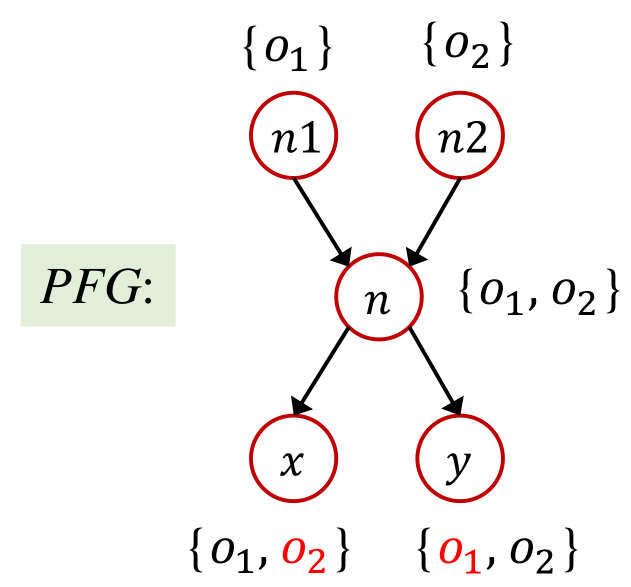

也就因此造成了分析结果的低精度，即在动态运行时i一定是1，而分析的结果认为i为NAC\(Not a constant\)：

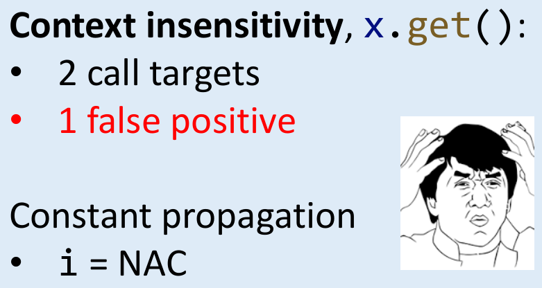

如果我们使用上下文敏感的分析方式，区分不同时间对的id调用，则会得到这样的PFG：

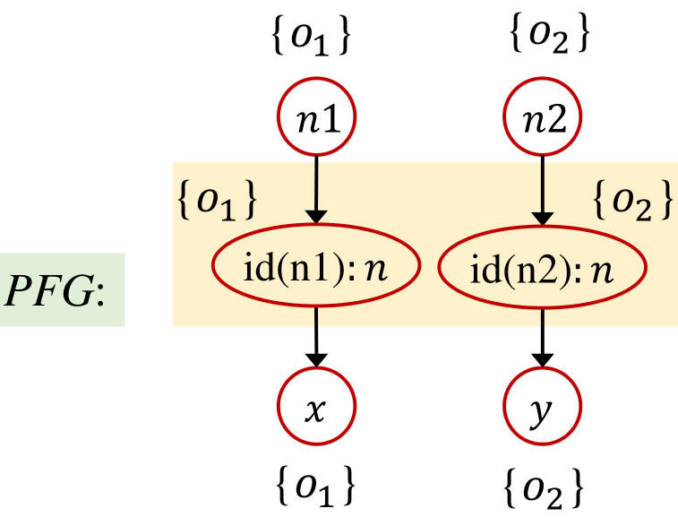

对应地也就能得到更为精确的分析结果：

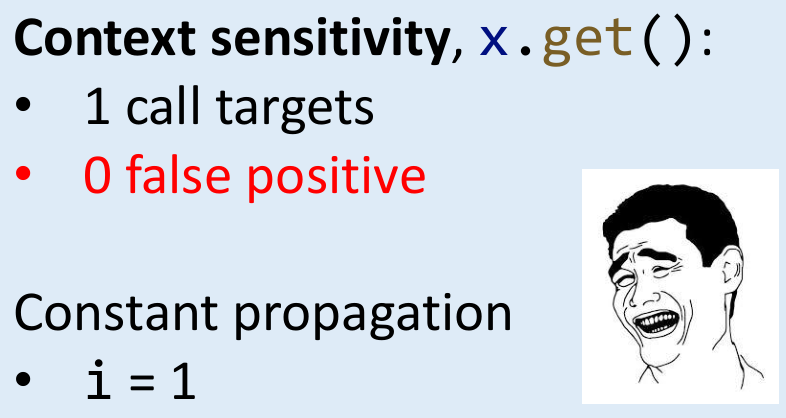

## Introduction\(Theory\)

### C.I.\(Context Insensitive\)

是什么原因导致了上下文不敏感分析的低精度？

1. 在动态执行时，对同一个函数的不同调用，往往有着不同的调用上下文（calling contexts），如上一小节的例子中两次对id的调用。
2. 不同的调用上下文会被混合并传播，进而形成假的数据流。如上一小节的例子中指针x和y指向两个目标。

### C.S.\(Context Sensitive\)

上下文敏感分析通过区分不同调用上下文的数据流，对调用上下文建模。举个例子，在这一段代码中，对id调用的上下文就是两行call-site，记为\[1\]和\[2\]：

```java
x = id(n1);    //context 1 for id()
y = id(n2); //context 2 for id()
int i = x.get();

Number id(Number n) {
    return n;
}
```

进而，我们可以**通过对同一函数的不同调用添加标号进行区分**，而得到更精确的PFG：

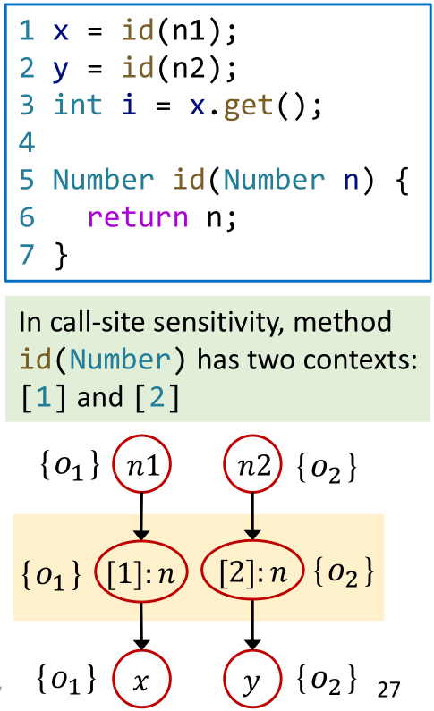

### C.S. heap

**对于Java中被动态分配到heap上的对象，我们也需要对他们做相应的标记以提高分析精度。**例子：~~（或许真的需要录视频了？）~~

* 不做标记时，第八行new出来的对象无法区分，只能同一记作 $$ o_8$$ 
* 做标记后，可以分别记为$$ 3:o_8$$和$$ 4:o_8$$

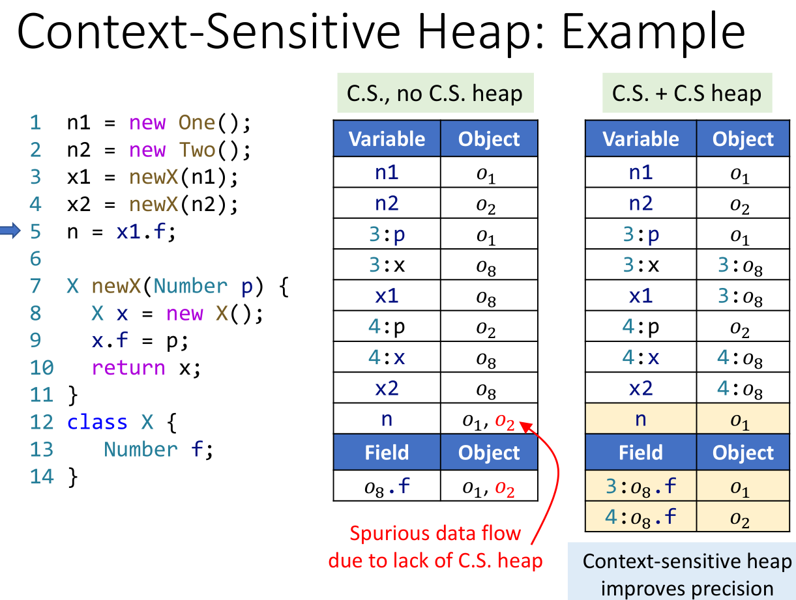

不过，采取C.I.+ C.S. heap进行分析时，C.S. heap就不能提高精度了。

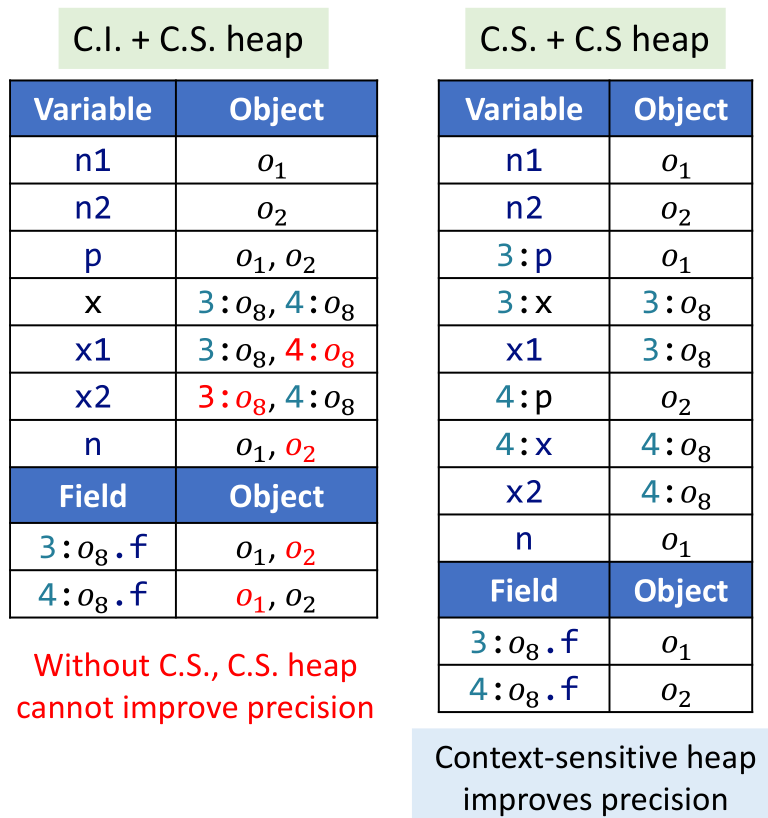

## Context Sensitive Pointer Analysis: Rules

### Domains and Notations

接下来我们用介绍适用于上下文敏感分析的规则。

首先我们讨论的Domain中，methods/variables/objects都升级为带有上下文标识的。

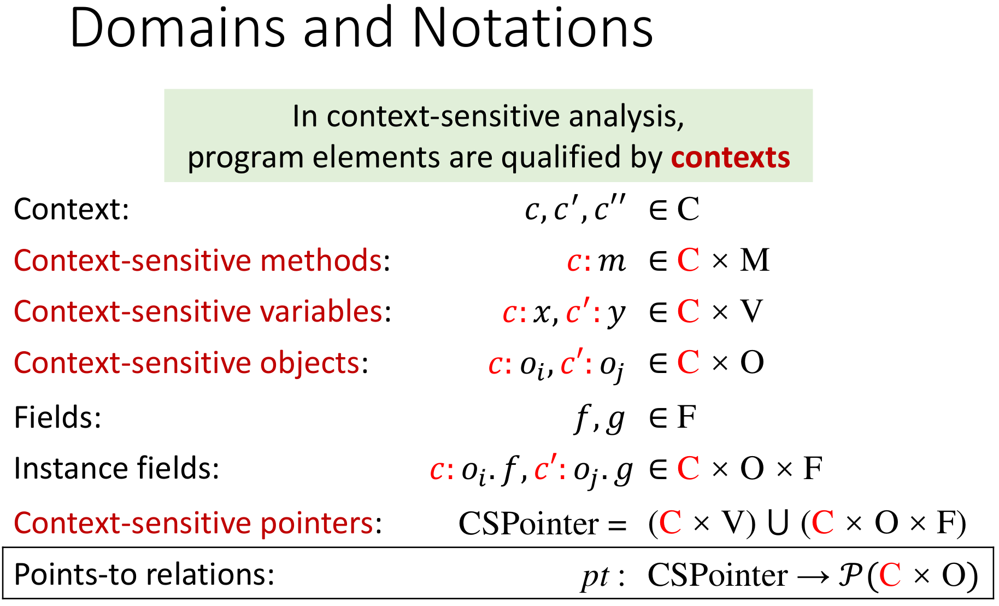

新引入符号说明：引入C表示所有的上下文组成的集合，c表示具体的某个上下文。

值得一提的是，fields不需要带有上下文标记，因为field总是依赖于某一个object。只要object被标记进而通过上下文可被区分了，fields自然也可以被区分。一个不太准确但是可以帮助理解的例子是，如果你能区分一对双胞胎，那么他/她们口袋里的东西也是可以被区分的。

### Rules

首先我们考虑不包含调用（Call）语句的四类语句所对应的规则。


对比一下上下文不敏感指针分析的规则：

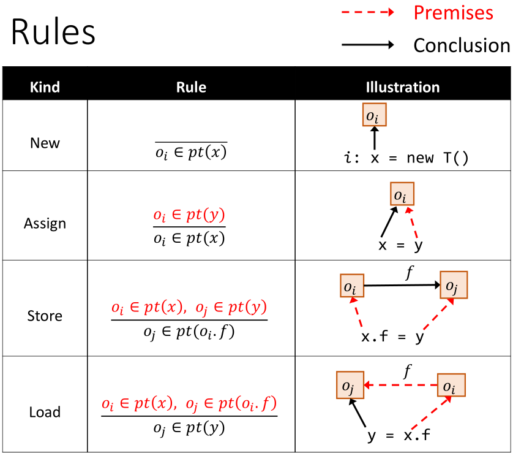

**唯一的区别在于，对象被加上了上下文标识。**

然后我们来看看调用如何处理。在上下文敏感的指针分析中，规则如下：

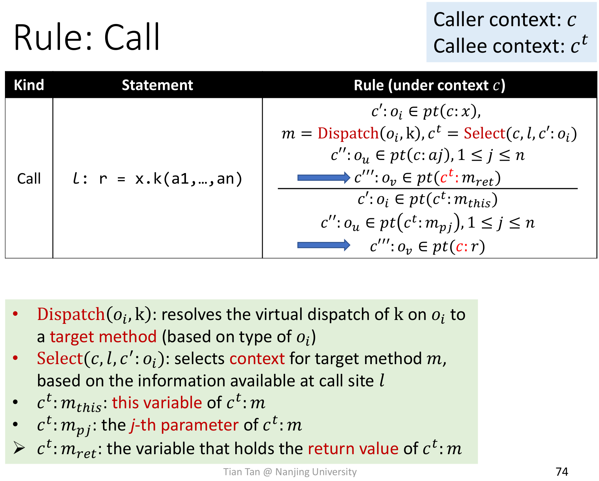

再次对比一下上下文不敏感指针分析的规则：

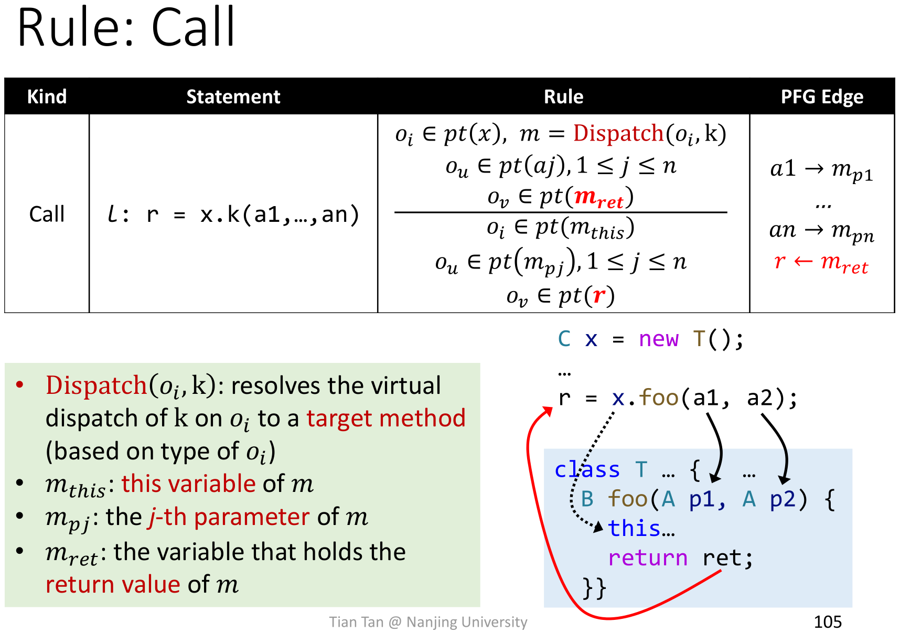

**这次我们添加了一个Select函数，它的作用是为object添加上下文标识，例如：**

* 为参数添加上下文标识

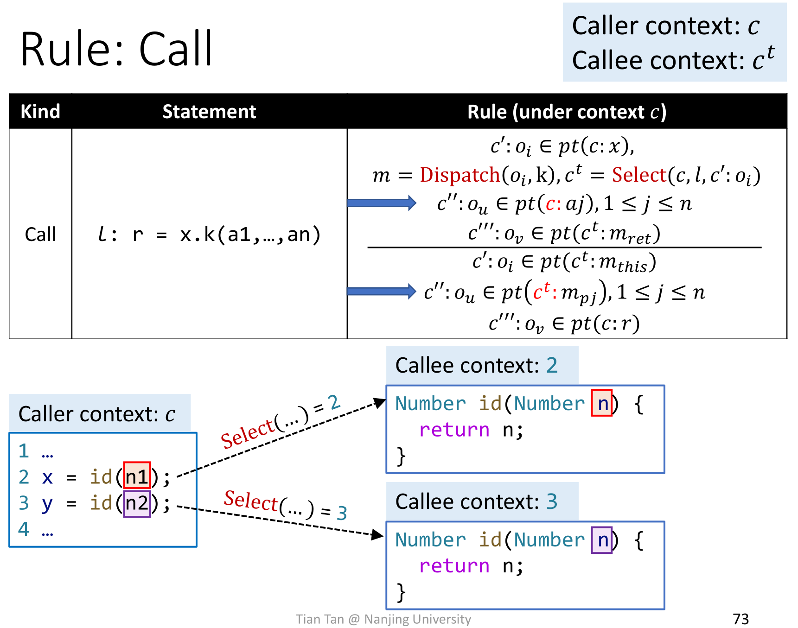

* 为返回值添加上下文标识

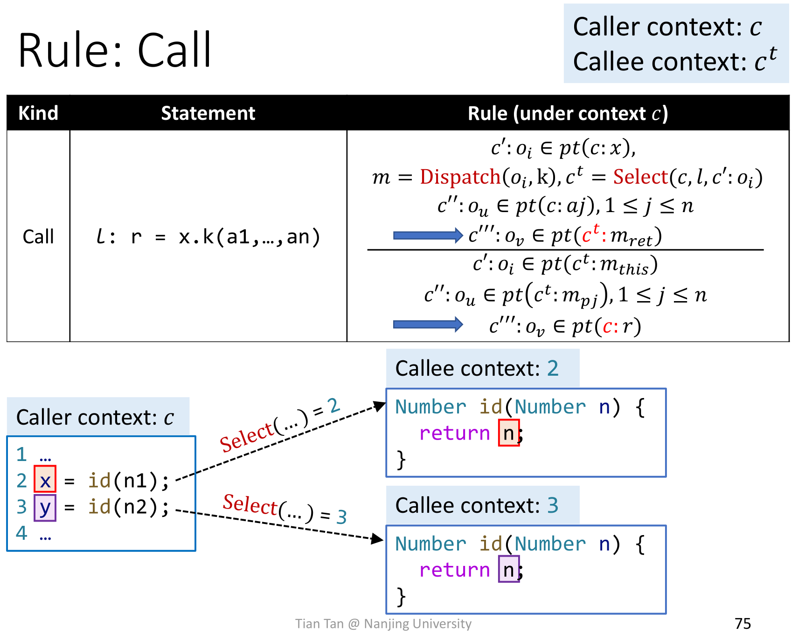

**也就是说，上下文的信息是在处理调用时添加的。**

## Key points

* Concept of context sensitivity \(**C.S.**\)
* Concept of context-sensitive heap \(**C.S. heap**\)
* **Why** C.S. **and** C.S. heap improve **precision**
  * 单独使用C.S.或C.S. heap依然会损失精度
* Context-sensitive pointer analysis **rules**

