# 上下文敏感分析（下）

> 上下文敏感分析是提高指针分析精度最有效的技术，没有之一。

本课分为以下五个部分：

1. Introduction\(Example\)
2. Introduction\(Theory\)
3. Context Sensitive Pointer Analysis: Rules
4. Context Sensitive Pointer Analysis: Algorithms
5. Context Sensitivity Variants

在上半篇中我们讲解了前三个部分，下半篇来继续讲最后的两个部分。

~~挖个坑——本文所有的例子其实都更适合视频讲解。~~

## Context Sensitive Pointer Analysis: Algorithms

### Idea

除了PFG做了相应改进之外，算法的总体思路没有改变。


具体来说，带有上下文信息的Node和Edge的构成带有上下文信息的PFG：

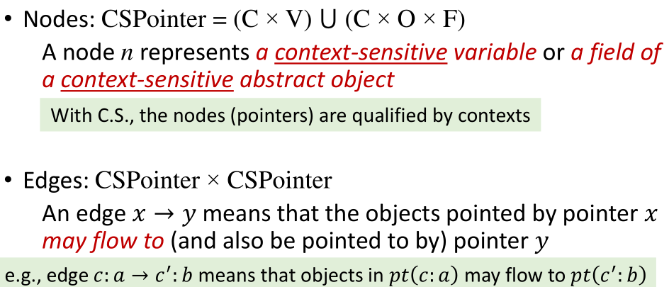

### Algorithm

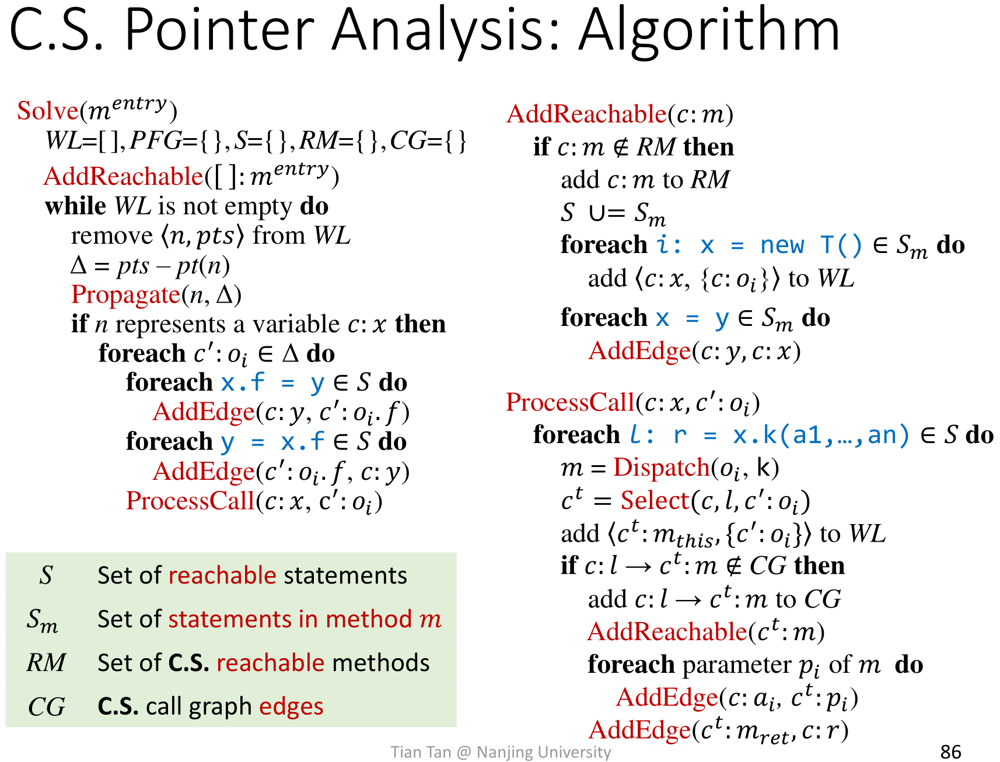

乍一看挺吓人的，对吧？不过你应该对上下文敏感\(C.S.\)指针分析算法的小伙伴上下文不敏感\(C.I.\)指针分析算法很熟悉了（下图中所有上下文标记都用色块遮挡了）：

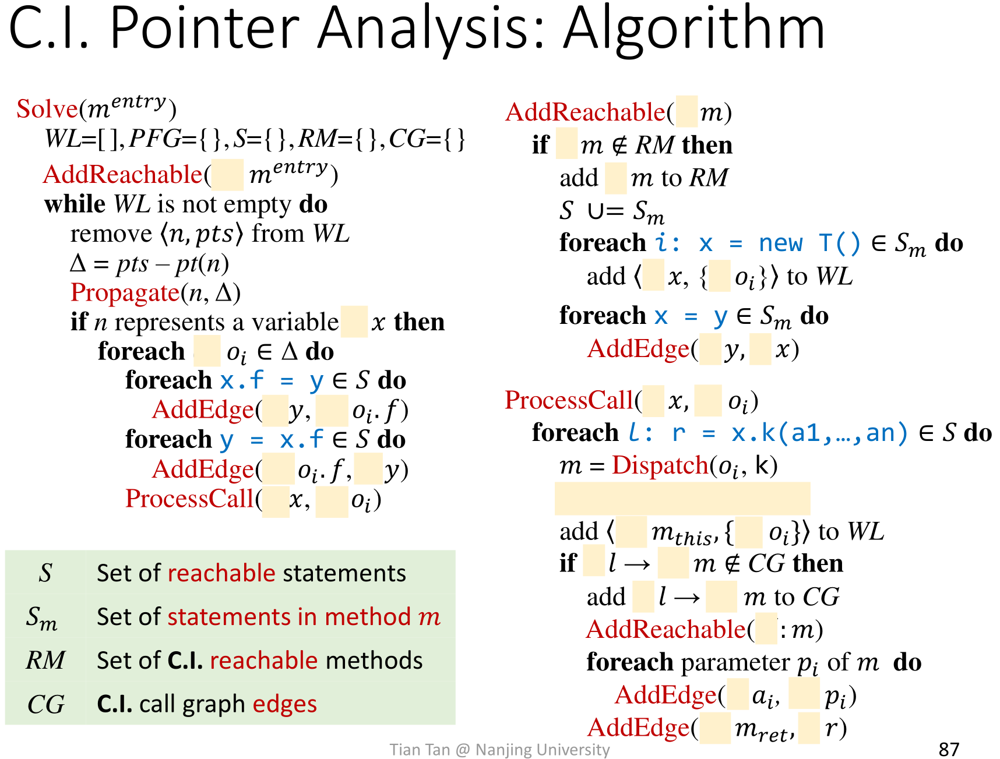

因此，在接下来的内容中我们更关注和上下文相关的部分，而不像之前一样详细地关注所有细节。

值得一提的差异是，RM和CG两个集合在本节所述的上下文敏感算法中都是带有上下文信息的。举个例子，在C.S.的分析中，caller和callee都带有上下文信息（$$ c^t$$ 代表callee的上下文标记，c:2-&gt;$$ c^t:\dots$$表示第二行的caller调用了带有$$ c^t$$标记的callee）：

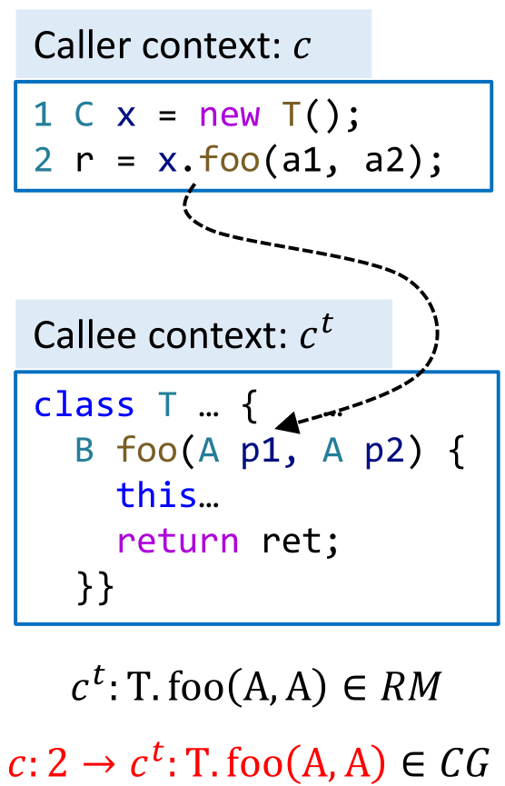

### Select in ProcessCall

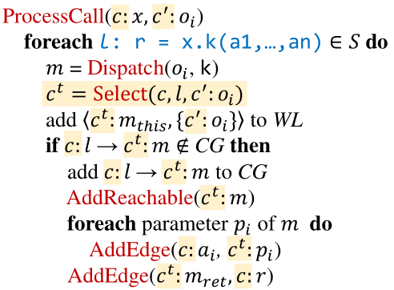

在这一部分，我们只需要理解Select的作用（对于Select的具体实现，会在后面讲解）：

* ProcessCall接收两个参数，意义是：带有上下文标记的x新增一个带有上下文标记指向目标o。
* m代表目标方法。
* Select接收参数（这里虽然有3个参数，但并非每种实现方式都需要用到所有的3个参数）
  * c。x的上下文标记
  * l。调用点本身（call site），在例子中以行号标识调用点
  * $$ c' : o_i $$。receiver object
* Select返回callee的context $$ c^t$$

## Context Sensitivity Variants

> 那，讲讲Select吧？

Select函数实现时的具体差异，产生了不同的上下文敏感分析的变种方法，它们有不同的优缺点。具体来说，就是

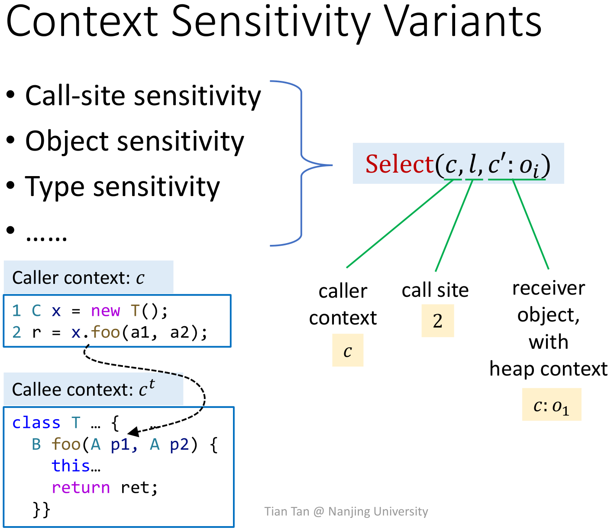

### C.I.

* 可以视为**C.S. 的一种特殊情况**，无论传递给Select的参数是什么，总是返回同样的上下文。即：

```java
Select(*,*,*) = []
```

### Call-Site Sensitivity

* 用一系列的**调用链\(call chain/call stream\)作为上下文标识**。
* Also called **call-string sensitivity**, or **k-CFA**

```java
Select(c,l,*) = [𝑙`, 𝑙``, 𝑙]
// where 𝑐 = [𝑙`, … , 𝑙``]
// 即：只根据caller已有的上下文和
// call-site的新增上下文
// 计算callee的上下文
```

举个例子直观地展示Call-Site Sensitivity：

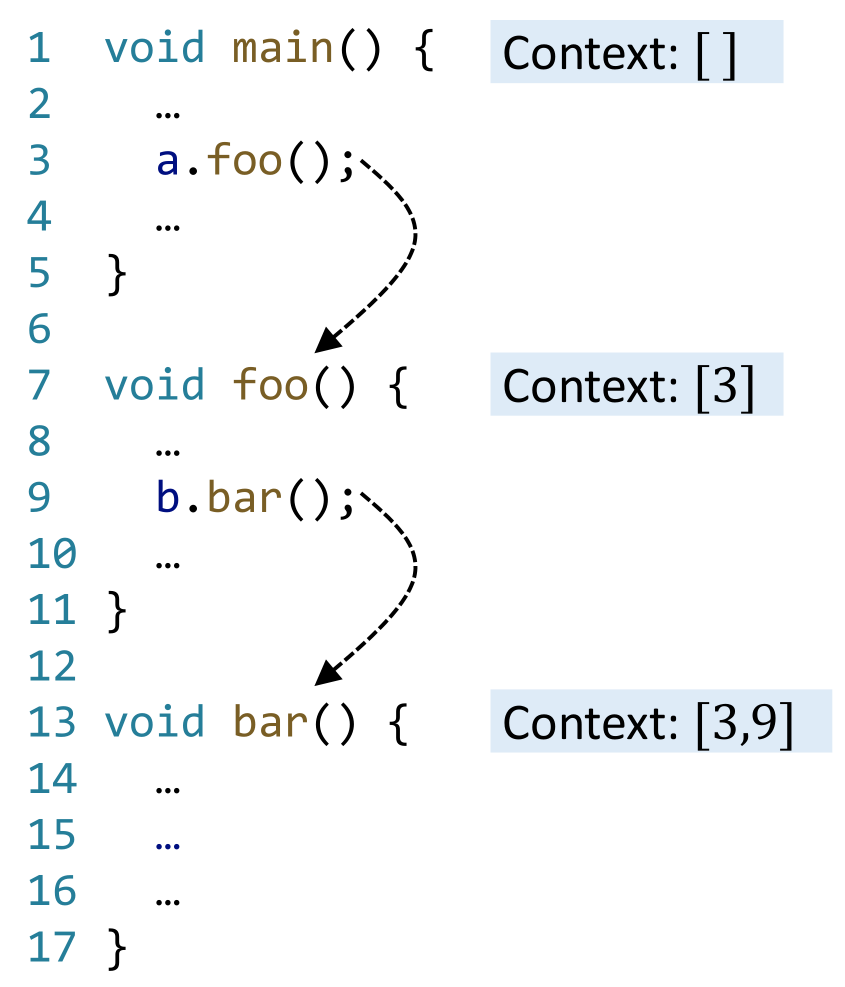

当然，如果bar是递归的，分析出来的context可能会包含非常多的内容……

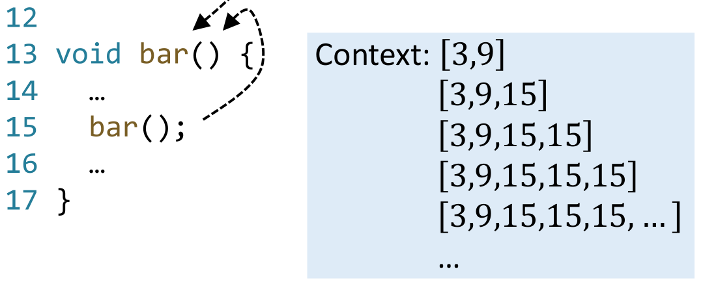

#### k-Limiting Context Abstraction

为了避免上面所说的递归导致的算法无法终止的情况，我们可以给contexts的长度设一个上界k。

* 1-call-site/1-CFA

  ```java
  Select(*,l,*) = [l]
  // 即：不继承caller已经带有的上下文
  // 只考虑call-site新引入的上下文
  // "只记得最近一次经过的路口是哪一个"
  ```

  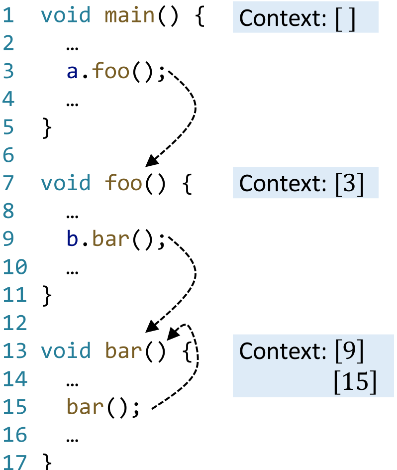

* 2-call-site/2-CFA

  ```java
  Select(c,l,*) = [l``,l]
  // where c = [l`,l``]
  // 即："只记得最后两次经过的路口是哪两个"
  ```

### Call-Site Example

分析以下代码，给出指针流图PFG和调用关系图CG作为结果。（不需要关注heap上的变量和this变量，因为它们在这个例子中不是重点）

```java
class C {
    static void main() {
        C c = new C();
        c.m();
    }

    Number id(Number n) {
        return n;
    }
    void m() {
        Number n1,n2,x,y;
        n1 = new One();
        n2 = new Two();
        x = this.id(n1);
        y = this.id(n2);
        x.get(); 
        // 先想想动态执行的时候上一行调用的结果是什么？
    }
}
```

答案如下：

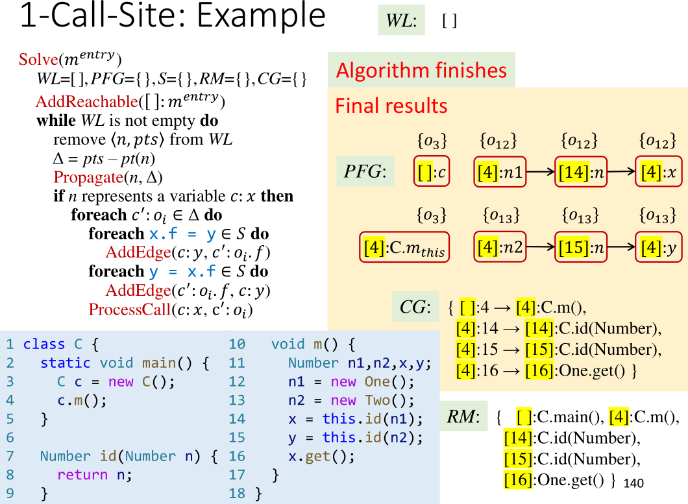

和C.I.对比，我们可以发现对于16行处的分析，C.S.\(1-Call-Site\)更加精确。

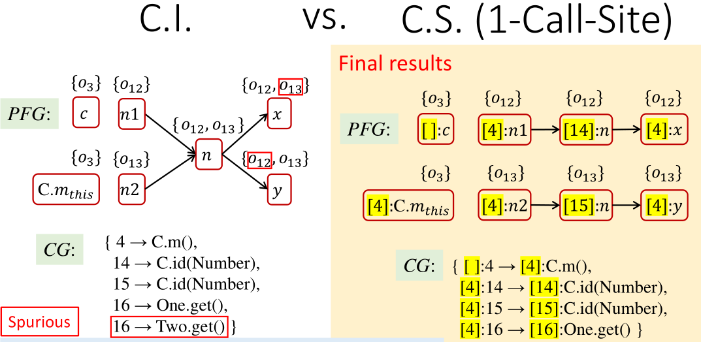

### Object Sensitivity

* **以receiver object作为上下文标识**
* Each context consists of a list of abstract objects \(represented by their allocation sites\)
  * At a method call, use the receiver object with its heap 

    context as callee context

  * Distinguish the operations of data flow on different objects
* 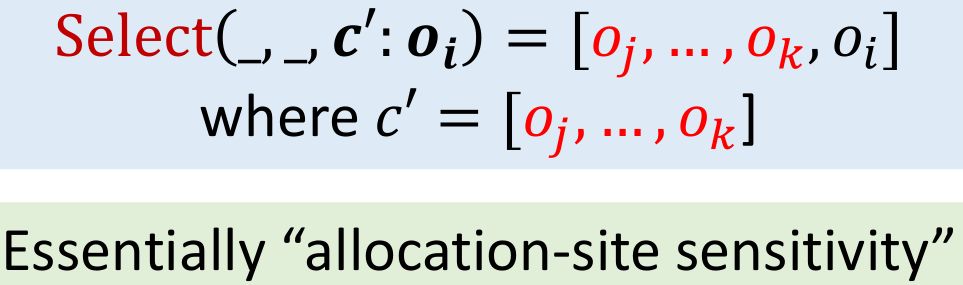

### Object Example & Comparison

分别用1-Call-Site和1-Object的方式分析以下代码，给出所有指针（包括Variable和Field）所指向的对象。

```java
a1 = new A();
a2 = new A();
b1 = new B();
b2 = new B();
a1.set(b1);
a2.set(b2);
x = a1.get();

class A {
    B f;
    void set(B b) {
        this.doSet(b);
    }
    void doSet(B p) {
        this.f = p;
    }
    B get() {
        return this.f;
    }
}
```

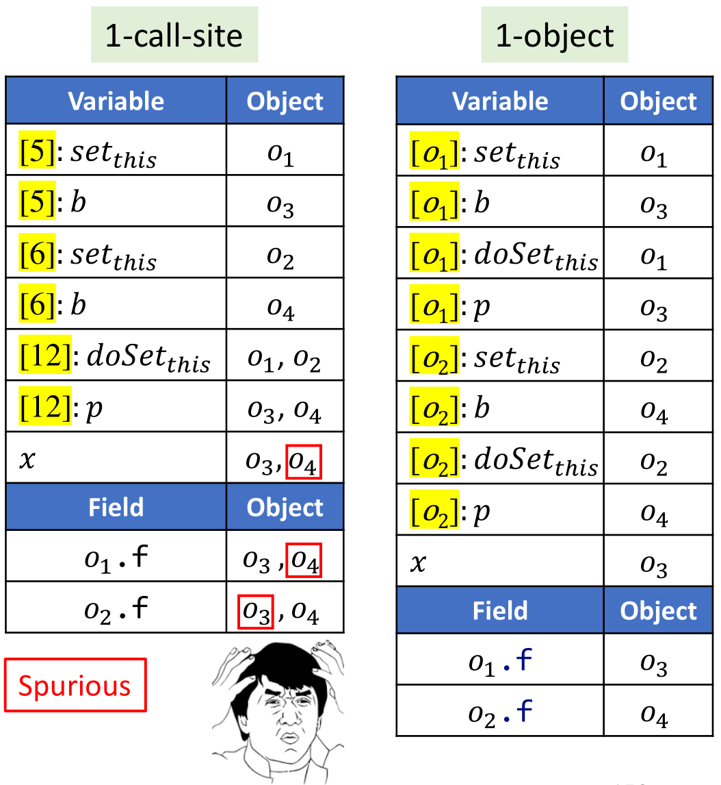

在12行，1-call-site的分析方法产生了不精确分析结果。在Call Graph中我们能够更好地看到这一点：

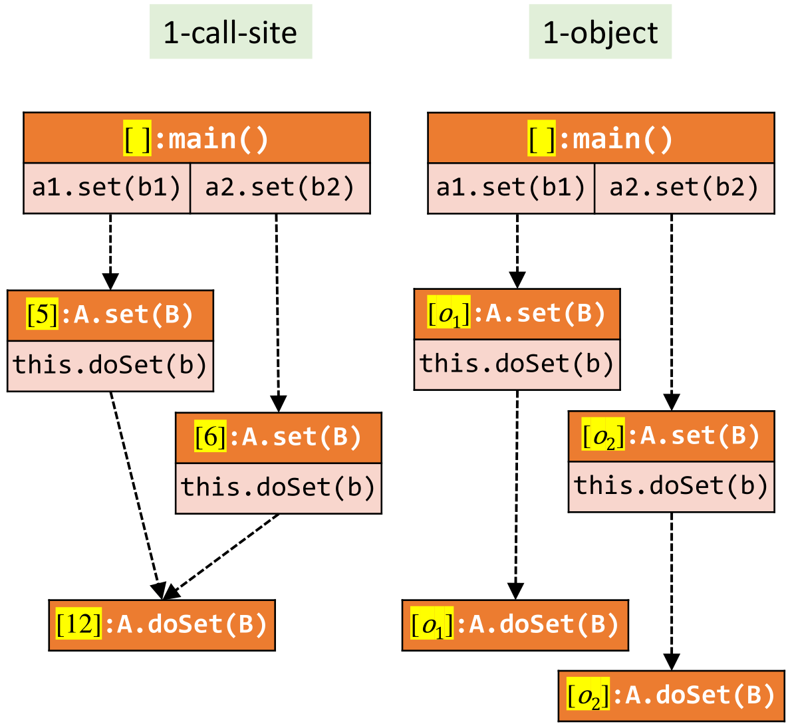

更加通俗地说，1-call-site只能记得自己是从哪个路口走到当前位置的，而1-object能够记得自己是谁。

然而并不能说明1-object的精度一定比1-call-site高。比如在分析以下代码时：

```java
class C {
    static void main() {
        C c = new C();
        c.m(); 
    }

    Number id(Number n) {
        return n;
    }

    void m() {
        Number n1,n2,x,y;
        n1 = new One();
        n2 = new Two();
        x = this.id(n1);
        y = this.id(n2);
        // 1-object无法区分以上两条调用
        // 但是1-call-site可以区分
        x.get();
    }
}
```

因此，在**理论上**，两种方法不可比。而在针对OO语言\(如Java\)的**实践中**，object方法的表现（无论是精度还是速度）**通常**更好，因为这更符合OO语言的特性。

### Type Sensitivity

* 和Object Sensitivity类似，但是粒度更粗而效率更高——这种方法只关注Object是在哪一个Class中被声明的。
* Each context consists of a list of types
  * At a method call, use the type containing the allocation site of the receiver object with its heap context as callee context

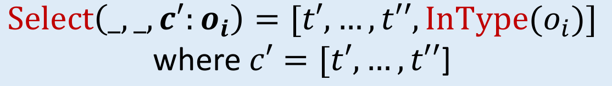

例如（如果你发现这个例子不太好理解，请先往下看看下一个例子）：

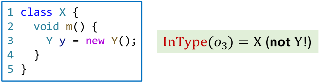

### Comparison\(Type vs. Object Sensitivity\)

阅读顺序建议：绿框-&gt;蓝框-&gt;无框。在Object-sensitivity中我们记录下每一个object被声明出来的行数。在Type-sensitivity中我们只记录它们都是在Class X中声明的。

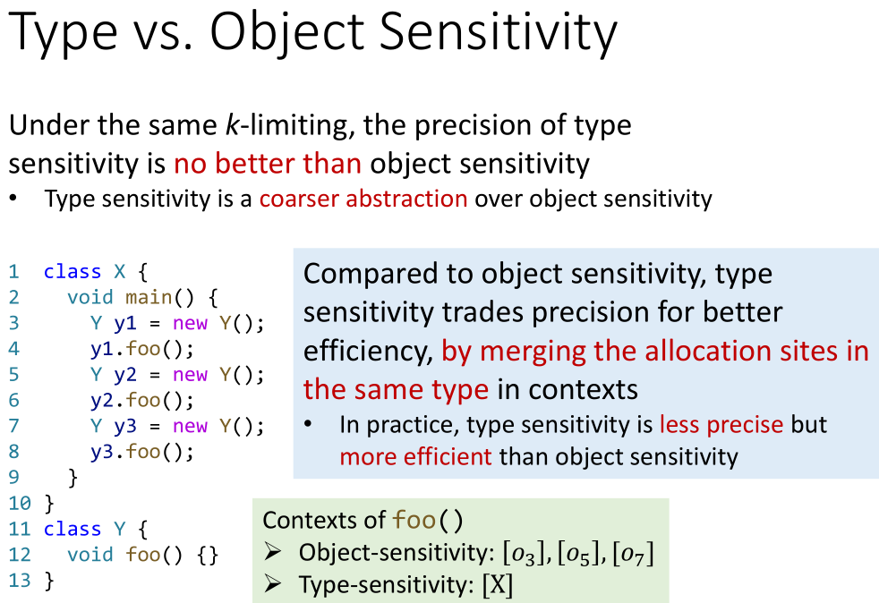

### Sum up

In general：

* Precision: object &gt; type &gt; call-site
* Efficiency: type &gt; object &gt; call-site

## Key points

* **Algorithm** for context-sensitive pointer analysis    
  * 和C.I.几乎一致
* 3 Common context sensitivity **variants**
  * Call-Site Sensitivity
  * Object Sensitivity
  * Type Sensitivity
* **Differences and relationship** among common 

  context sensitivity variants

  * 在面向对象语言（如Java）中，Object Sensitivity通常比Call-Site Sensitivity表现更好
  * 如果追求速度，可以进而选用Type Sensitivity

