# 指针分析理论（上）

接下来两篇文章将主要介绍以下四点内容。前三点对应线下课程第九课，最后一点对应第十课。

1. Pointer Analysis: Rules
2. How to Implement Pointer Analysis
3. Pointer Analysis: Algorithms
4. Pointer Analysis with Method Calls

我们先关注前三点，暂时不理会函数调用。

## Notations

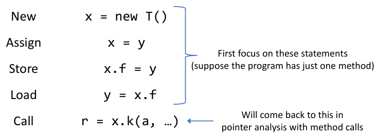

首先介绍常用数学符号，不会的同学可以复习一下离散数学。

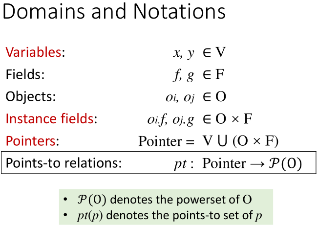

分别定义变量，域，对象（用下标标识是在第几行创建的对象），实例域和指针（是变量和实例对象的并），和指向关系。`X`表示笛卡尔积。

pt\(p\)代表的是指针p可能指向的对象。如在下面的代码块后，pt\(x\)可能指向的目标可以记为$$ {o_2,o_4}$$（以行号作为object的下标）。

```java
if(...){
    x = new A();
} else {
    x = new B();
}
```

## Pointer Analysis: Rules

_前排提示：与《数理逻辑》/《形式化语义》梦幻联动。没学过的同学也不要着急。_

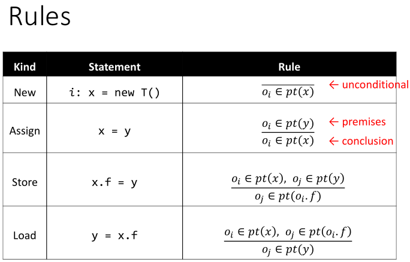

主要解释Rule一列中的内容。**横线上的内容是前提\(Premises\)，横线下的内容是结论\(Conclusion\)。**

用简单易懂的语言描述，看到new语句，我们就将新建的对象加入`pt(x)`。


对于Assign语句，我们将x指向y指向的对象。


对于Store和Load亦然。


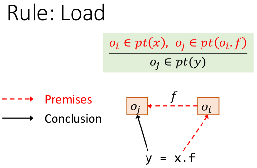

### Summary

最后用一图总结。**第一条规则添加指向，而后三条规则传递指向关系。**

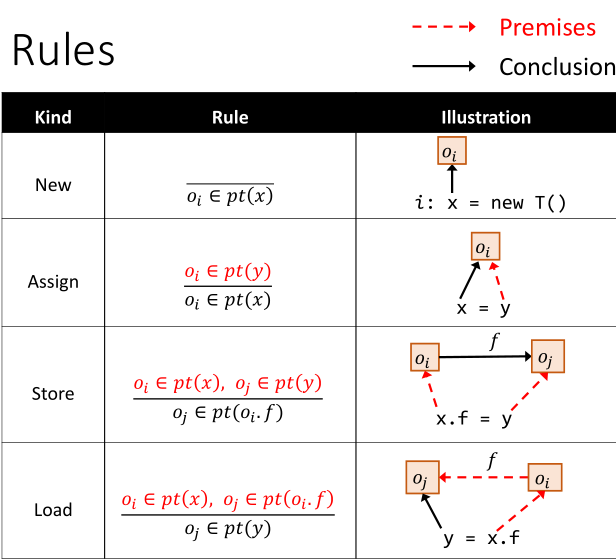

## How to Implement Pointer Analysis

_别处的资料都没有全家桶，只介绍某些特殊情况下的分析算法。在这里你能喜提一个完整的指针分析算法全家桶。_

本质上来说，指针分析是在指针间**传递**指向关系。

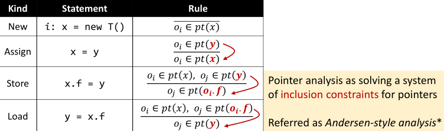

inclusion constraints的具体解释：在上述表示的结论部分中可以写作两个集合间的包含关系。如Load应该表示为：

* 前提：`y=x.f`和 $$ o_i \in pt(x)$$
* 结论：$$ pt(o_i.f) \subset pt(y)$$

> Key to implementation: when 𝑝𝑡\(𝑥\)is **changed**, **propagate** the **changed par**t to the **related pointers** of 𝑥


### Pointer Flow Graph

> Pointer Flow Graph \(PFG\) of a program is a directed graph  
> that expresses how objects flow among the pointers in the program.

为了实现指针分析，我们首先了解与之密切相关的数据结构——指针流图。

图的两大要素是Node和Edge。我们定义：

* `Node: Pointer = V ⋃ (O × F)`
  * A node n represents **a variable** or **a field of an abstract object**
* `Edges: Pointer × Pointer`
  * **An edge 𝑥 -&gt; 𝑦** means that the objects pointed by pointer 𝑥 **may flow to \(and also be pointed to by\)** pointer 𝑦

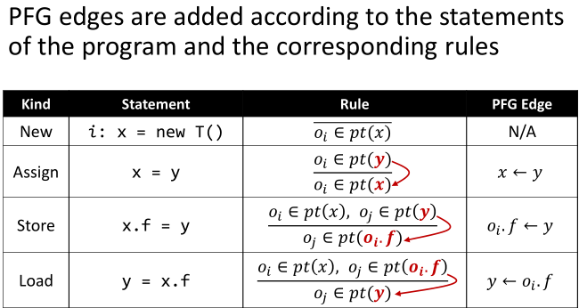

### Example

假设c和d一开始都指向 $$ o_i$$，根据上述规则，我们能够从左侧的程序语句从上到下构建出右侧的指针流图。

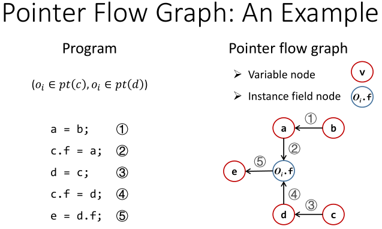

因此，所有b所指向的对象更新时，都要传递到e中。这是一个求传递闭包\(transitive closure\)的过程。假如我们考虑j位置的一条新语句`b = new T();`

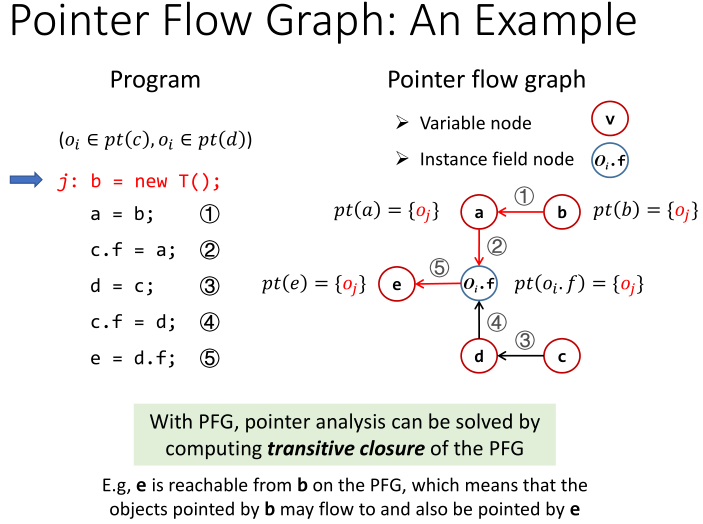

PFG的整个构造过程，需要在构建PFG和在已有的PFG上传递指向关系这两个步骤间循环往复。这两个步骤是相互依赖的，所以需要精心设计算法来实现分析。

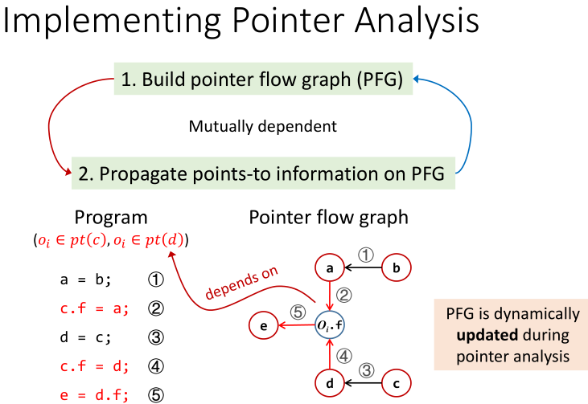

## Pointer Analysis: Algorithms

### Introduction to algorithm

* 由于做流不敏感分析。输入为Set，丢失了语句的顺序关系也没关系。
* WorkList：保存接下来要处理的指向信息，与BFS中的队列作用类似。
* pts定义：Each worklist entry 𝑛, 𝑝𝑡𝑠 is a pair of pointer 𝑛 and points-to set 𝑝𝑡𝑠, which means that 𝑝𝑡𝑠 should be propagated to 𝑝𝑡\(𝑛\)
  * E.g.,  $$ [(x,\{o_i\}),(y,\{o_j, o_k\}),(x.f,\{(o_l)\}),\dots]$$

首先，四个红框部分对应之前提到的四种基本语句——New、Assign、Store和Load。接下来做详细讲解。

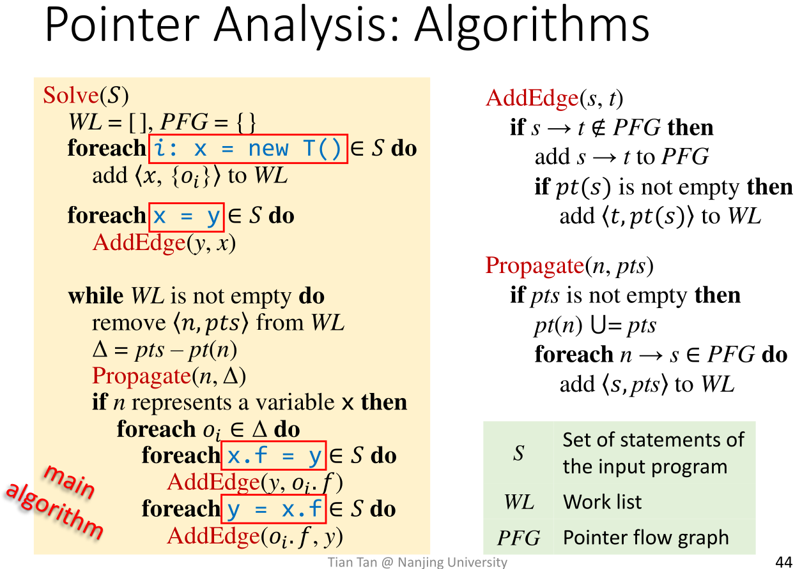

### Handling of New and Assign

#### Init and adding edges

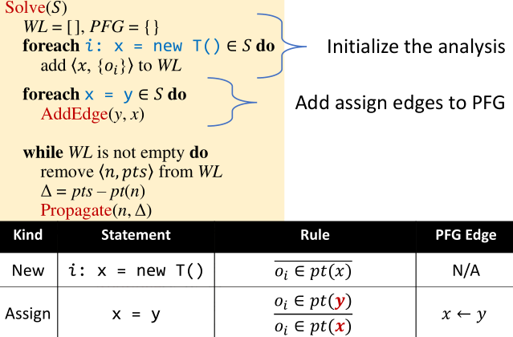

首先考虑两种简单的语句：New和Assign。

* 前三行代码做初始化的工作，并针对所有的**New**语句，将所有的初始指向关系加入WorkList。注意pt\(n\)初始化后为空集{}，随着算法的迭代会增加元素。
* 之后的两行代码处理**Assign**语句，添加`y->x`的边到PFG中。添加边的具体算法如下

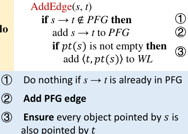

#### Propagate

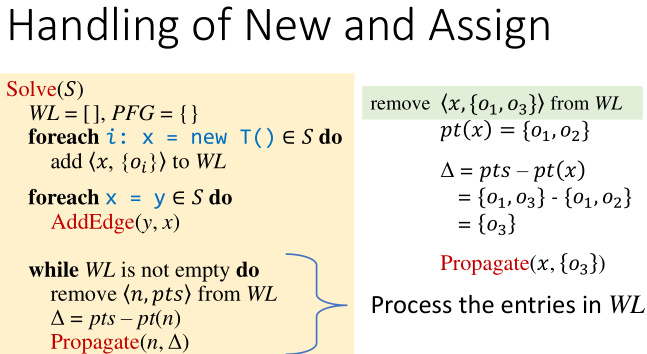

传播的具体算法如下，标号为2的语句是整个算法中唯一执行后改变指向关系的语句。


#### Detial-Differential Propagation

在真实的指针分析中，对象的数量非常巨大（上亿），我们通过Differential Propagation来消除冗余。

```cpp
Solve(𝑆)
    ...
    while WL is not empty do
        remove 𝑛, 𝑝𝑡𝑠 from WL
        Δ = pts – pt(n) // Differential Propagation
        Propagate(n, Δ) // Differential Propagation
```

首先我们考虑不使用Differential Propagation的情况，首先是a-&gt;c-&gt;d的传递路线。


然后是b-&gt;c-&gt;d的传递路线，虽然 $$ \{o_1, o_3\}$$之前已经在c所指向的集合中了，但依然需要参与传播，这是冗余的。

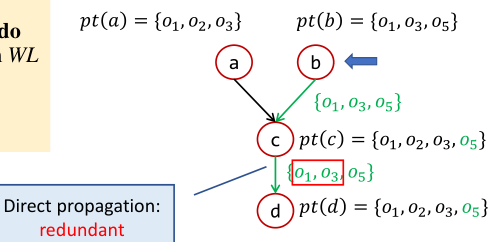

我们再来看使用Differential Propagation的情况，只需要传播$$ \{o_5\}$$一项即可。在实际应用中这能够大大减小开销。


* In practice, Δ is usually small compared with the original set, so propagating only the new points-to information \(Δ\) 
* Besides, Δ is also important for efficiency when handling stores, loads, and method calls, as explained later

### Handling Store and Load

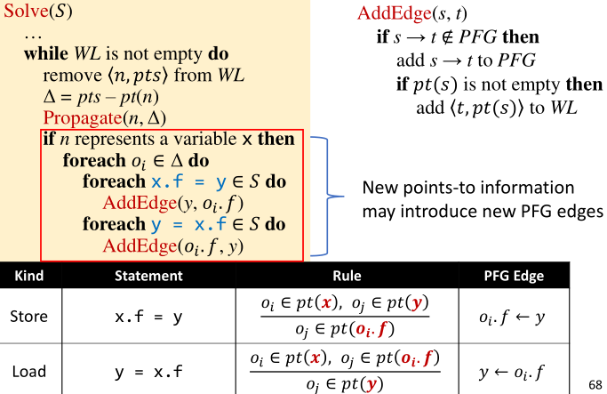

对于AddEdge函数中第二个if的说明：仅在第一次添加s-&gt;t到PFG时添加pt\(s\)的信息到t，是因为Propagate中的语句能够处理后续的pt\(s\)变化。

### The Algorithm-Review

至此，我们完整地介绍了为了教学目的设计的指针分析算法。


### Example

**尝试用上述算法，计算以下代码的PFG。**

```java
b = new C();
a = b;
c = new C();
c.f = a;
d = c;
c.f = d;
e = d.f;
```

这一例子动态内容很多，所以计划录制一小段视频讲解。先放个答案，能自己推导对的同学就可以跳过视频了。

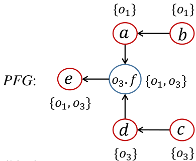

## Key points

* **Rules** for pointer analysis 
* **PFG**\(Pointer flow graph\)
* **Algorithm** for pointer analysis 

