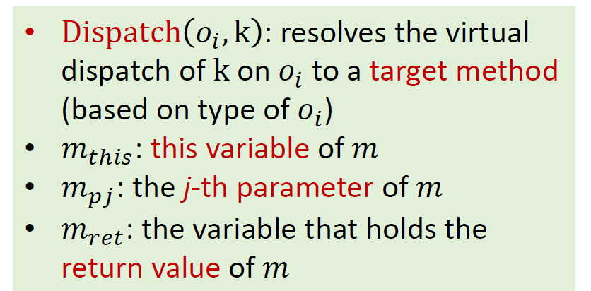
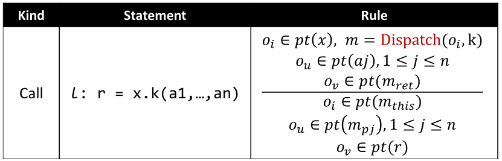
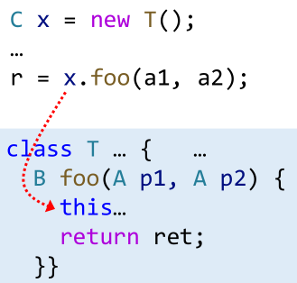
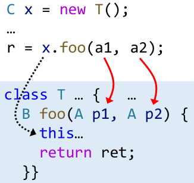
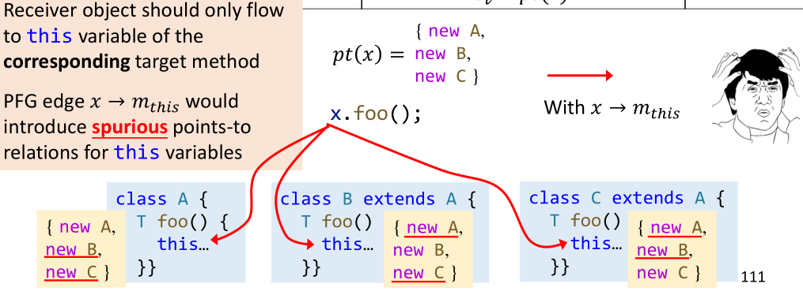
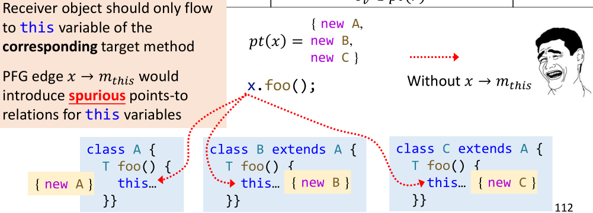
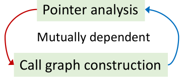
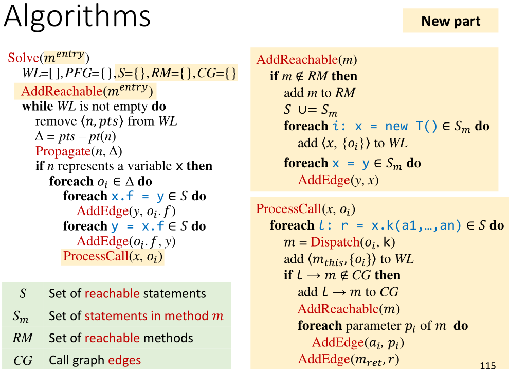
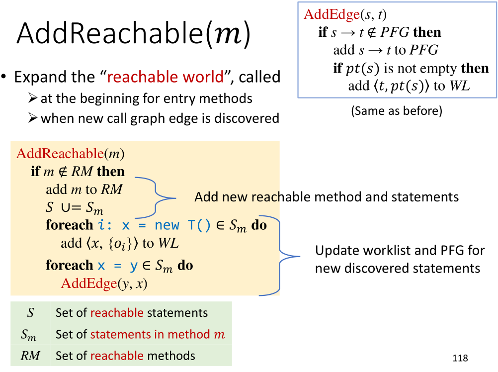
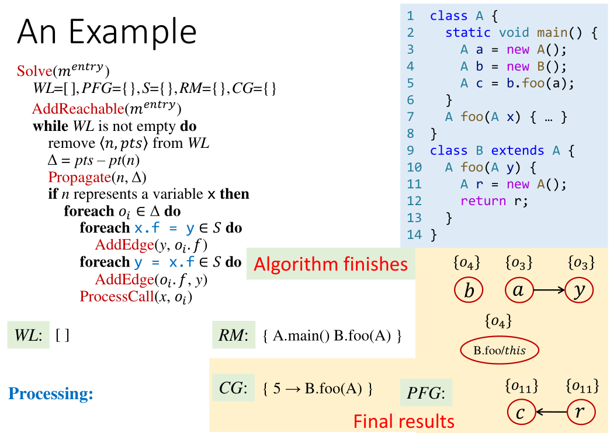

# 指针分析理论（下）

首先回顾一下在上一篇文章中列出的大纲。

1. Pointer Analysis: Rules
2. How to Implement Pointer Analysis
3. Pointer Analysis: Algorithms
4. Pointer Analysis with Method Calls

承接上一篇，本文谈谈包含指针分析如何处理函数调用。接下来用指针分析的方式来构建Call graph，先来对比一下CHA和指针分析两种方法：

* CHA: imprecise, introduce spurious call graph edges and points-to relations
* Pointer analysis: more precise than CHA, both for call graph and points-to relations\(a.k.a on-the-fly call graph construction\)

## Pointer Analysis with Method Calls

本课将给出一个包含函数间分析的适用于全程序的算法。

考虑下面这样一小段代码，显然，我们必须要有过程间的分析，才能有更准确的分析结果。

```java
void foo(A a) {
    …
    // 𝑝𝑡(𝑎) = ?
    b = a.bar();
    // 𝑝𝑡(𝑏) = ?    
    …
}
```

### Rule for Call

和过程间分析紧密相关的是过程调用的处理。也就是上节课提到的最后一条与Call有关的规则。

这个规则看起来复杂得多，我们一点一点来解析。首先，请读者们暂停一下，回忆一般语言如何处理过程调用。即过程调用时到底发生了什么。

各个符号的定义为：





> 一个参考答案：保存现场，构造调用栈帧，传递参数，跳转到目标函数开始执行……目标函数执行完毕跳转回来，后从预定的位置取返回值（若需要），恢复现场，继续往下执行……

在静态分析中，我们更多地关心数据流，而非控制流。而针对Java，处理函数调用的数据流可以分为以下四个部分：

1. 确定目标方法。用第7课介绍过的Dispatch函数完成。
2. 传receiver object



3. 传参数



4. 传返回值


因此，我们可以对应规则，在PFG上添加Edge实现过程间信息的传递。完整的规则如下：


#### Detail-1

**Question: Why not add PFG edge 𝑥 →** $$ 𝑚_{𝑡ℎ𝑖𝑠}$$**？**

通过这两个图可以直观地说明原因：





_在每次算法执行时，_$$ o_i$$_是确定的某个（只有一个）对象，然后针对这个对象做Dispatch，能够找到对应的唯一的receiver object._

#### Detail-2

像之前用CHA做过程间分析时一样，我们需要将分析的过程和Call graph构建的过程结合起来。



不同的是，这次我们只分析从main方法（或者一般性地说，程序入口）开始可达的部分。原因有二：

1. 提升分析速度。因为我们能够避免分析不会被执行到的死代码。
2. 提升分析精度。避免了unreachable部分的代码调用reachable部分方法时可能引起的精度下降。


## Algorithm: PA with Method Calls

接下来介绍一个具体的、易于理解和实现的算法。由于指针分析是静态程序分析的基础，理解了这个看起来枯燥的算法后，更容易在静态程序分析领域触类旁通。~~而且据说后面两节课会学得更加轻松~~



算法整体上来说和上一节课所介绍的大框架相似，黄色标记的部分是这次新加入的部分。绿色部分是对新的全局变量的说明：

* S里的statements就是RM里methods的statements（语句）
* Call Graph和指针集作为最后的输出。

### Function: AddReachable

AddReachable的作用是：

* **输入参数**m是最新的可达方法。
* 函数修改维护全局的RM、S和$$ S_m$$，并处理新的方法m中的New和Assign语句。



#### Detail-3

**Question: 为什么要检查l-&gt;m是否在CG中，即为什么同样的l-&gt;m可能不止一次地被处理？**

_l代表call site。可以用行号作为call site的label。_

> Answer: $$ o_j, o_k$$同样可能通过Dispatch返回同一个m。

### Function:ProcessCall

ProcessCall的作用是：

* 输入的$$ o_i$$是x新指向的目标。
* 函数在可达的语句集合S中，选择所有与x有关的过程调用，做之前提到的数据流相关四步处理（确定被调用方法、传对象、传参数，传返回值）。


## Example

**利用之前学习的算法分析以下代码，构建Call graph和PFG。**

```java
class A {
    static void main() {
        A a = new A();
        A b = new B();
        A c = b.foo(a);
    }
    A foo(A x) { … }  
}
class B extends A {
    A foo(A y) {
        A r = new A();
        return r;
    }
}
```

答案如下：



这个流不敏感的分析算法在分析精度上仍然可以改进。我们将在接下来的课程中学习精度更高的流敏感分析。

## Key points

* Pointer analysis **rule for method call**
* **Algorithm** for inter-procedural pointer analysis 
* **On-the-fly call graph construction**

