# 过程间分析简介

本小节通过四个部分介绍过程间分析。

1. Motivation
2. Call Graph Construction (CHA)
3. Interprocedural Control-Flow Graph
4. Interprocedural Data-Flow Analysis

# Motivation

之前的章节中，都不考虑方法调用，然而方法调用在程序中真实存在。

例子：

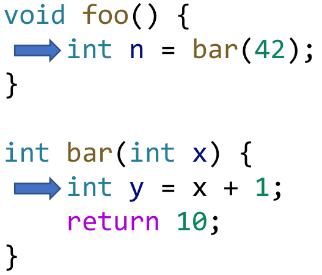

-   最简单的情况下：做最保守的假设，即为函数调用返回NAC。而这种情况会丢失精度。引入过程间分析能够提高精度。

# Call Graph Construction (CHA)

## Call Graph

>   A representation of calling relationships in the program.

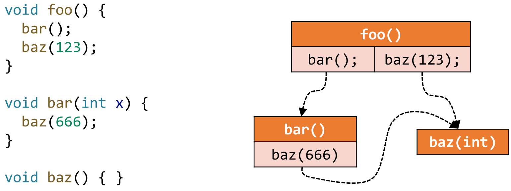

在现代常用的语言中，大多数情况下会使用OO语言。本课则主要关注Java。

## Call Graph Construction

Call Graph有很多种不同的构造方法，我们接下来会讲解两个极端：最准确的和最快速的。

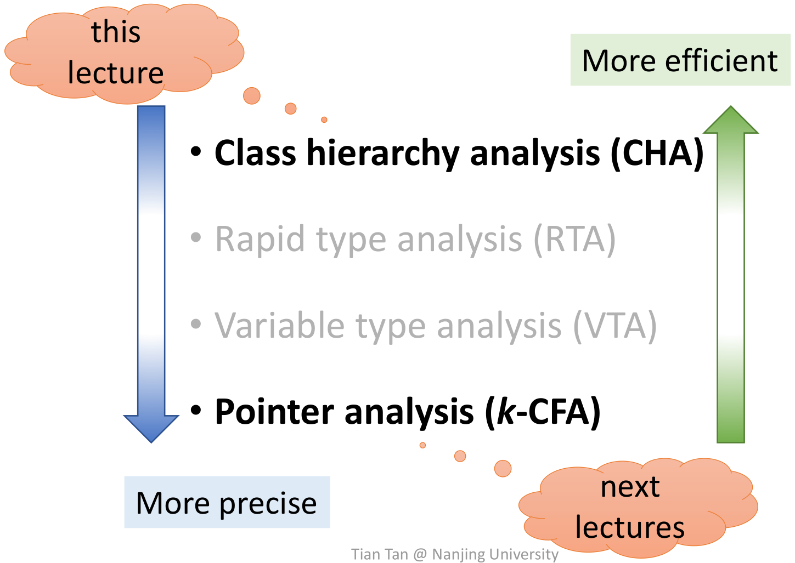

### Call types in Java

Java中call可分为三类：

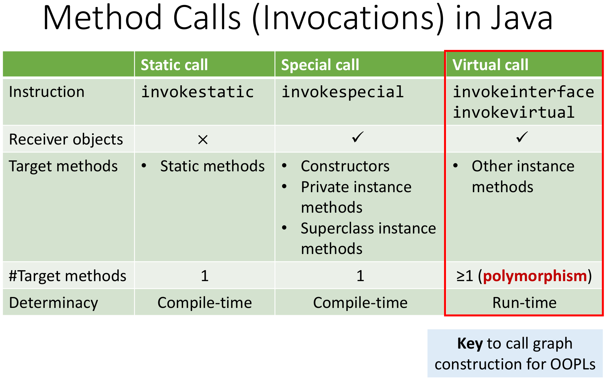

-   指令：指Java的IR中的指令
-   接收对象：Static方法不需要对应实例。
-   对象方法：对应的call会在列出的情况下被使用
-   方法的对象：Virtual call与动态绑定和多态实现有关，可以对应多个对象，只能在动态时决定调用哪一个具体方法的实现。

### Virtual call and dispatch

接下来重点讨论Virtual call：

在动态运行时，Virtual call基于两点决定调用哪个具体方法：

1.  Type of object

2.  Method signature

    -   Signature = class type + method name + descriptor
    -   Descriptor = return type + parameter types

    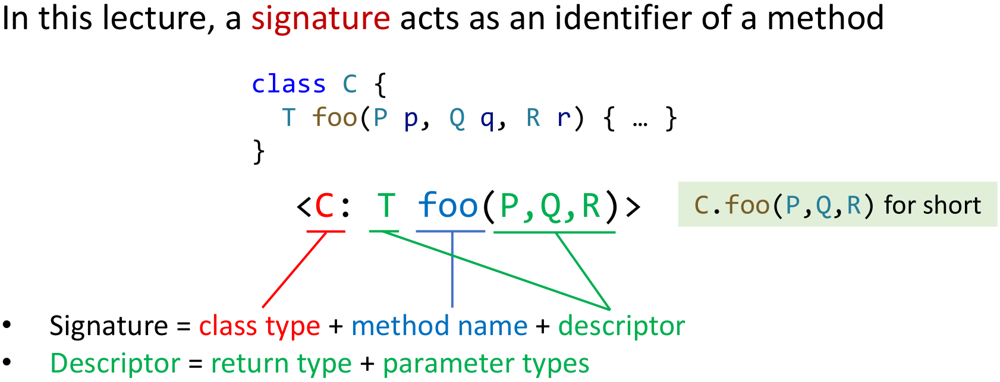

Java中Dispatch（决定具体调用哪个方法）的机制：c是一个类的定义，m是一个方法。如果能在本类中找到name和descriptor一致的方法，则调用c的方法，否则到父类中寻找。

>   We define function Dispatch(𝑐, 𝑚) to simulate the procedure of run-time method dispatch.

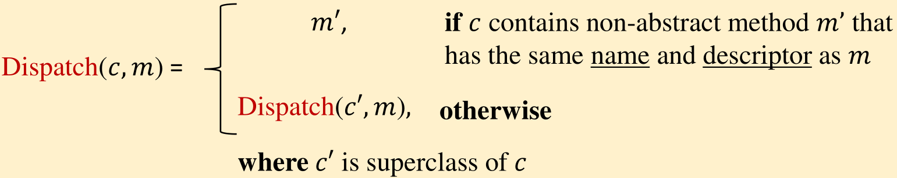

练习问题

Q：两次对foo的调用分别调用了哪个类的foo？

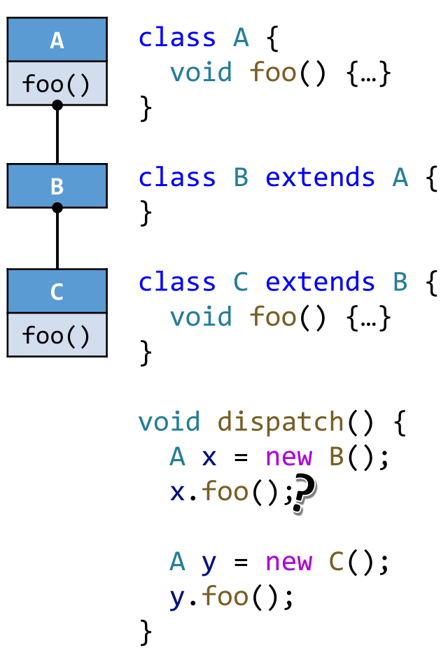

A：分别调用A和C中定义的foo方法。

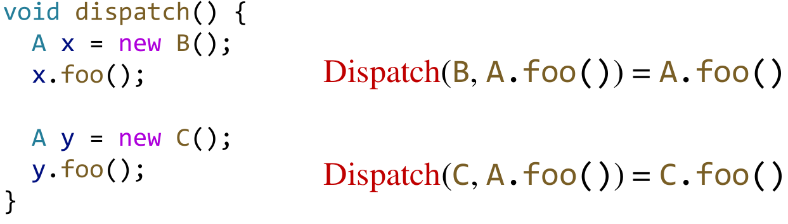

# Class Hierarchy Analysis (CHA)

## Definition of CHA

-   Require the class hierarchy information (inheritance structure) of the whole program
-   Resolve a virtual call based on the declared type of receiver 
    variable of the call site
-   Assume the receiver variable a may point to objects of class A
    or all subclasses of A
    -   Resolve target methods by looking up the class hierarchy of class A

## Call Resolution of CHA

###  Algorithm of Resolve

-   call site(cs)就是调用语句，m(method)就是对应的函数签名。
-   T集合中保存找到的结果
-   三个if分支分别对应之前提到的Java中的三种call类型
    1.  Static call(所有的静态方法调用)
    2.  Special call(使用super关键字的调用，构造函数调用和Private instance method)
    3.  Virtual call(其他所有调用)

**Static call**

-   对于不了解OOP中静态方法的同学可以参考[这里](https://www.geeksforgeeks.org/static-methods-vs-instance-methods-java/)。具体来说，静态方法前写的是类名，而非静态方法前写的是变量或指针名。静态方法不需要依赖实例。 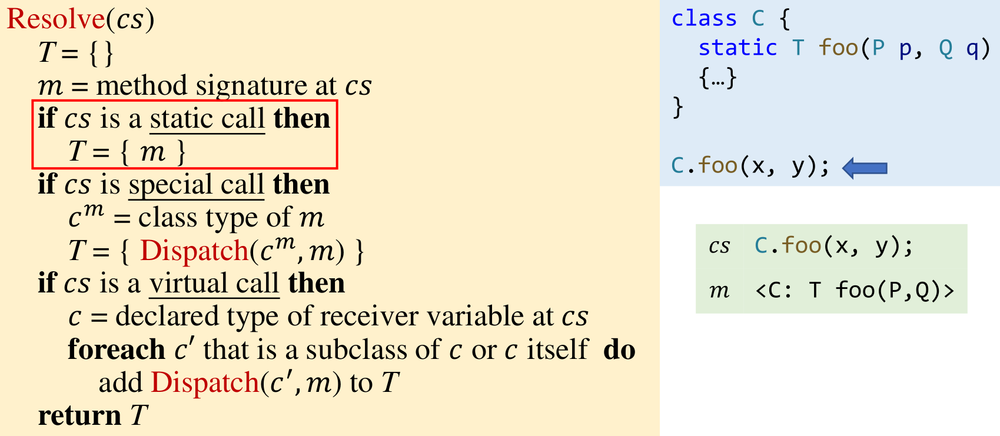

**Special call**

-   Superclass instance method（super关键字）最为复杂，故优先考虑这种情况

    -   为什么需要Dispatch函数？考虑这种情况：

        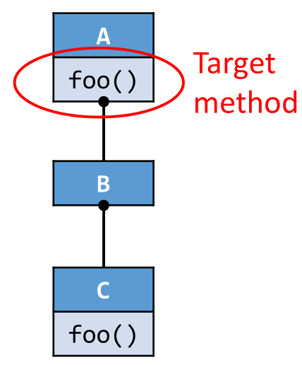
-   而Private instance method和Constructor（一定由类实现或有默认的构造函数）都会在本类的实现中给出，使用Dispatch函数能够将这三种情况都包含，简化代码。

**Virtual call**

-   receiver variable在例子中就是a。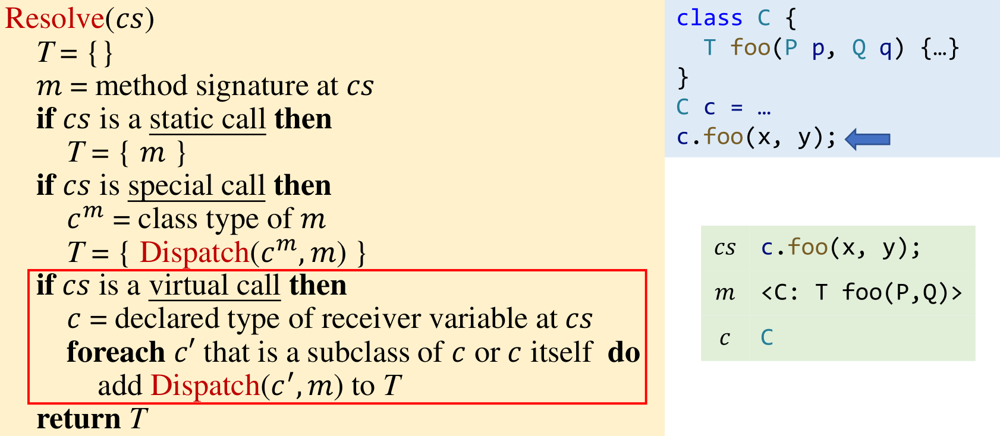

-   对receiver c和c的所有直接间接子类都作为call site调用Dispatch

一些例子：

## CHA的特征

1.  只考虑继承结构，所以**很快**
2.  因为忽略了数据流和控制流的信息，所以**不太准确**

## CHA的应用

常用于IDE中，给用户提供提示。

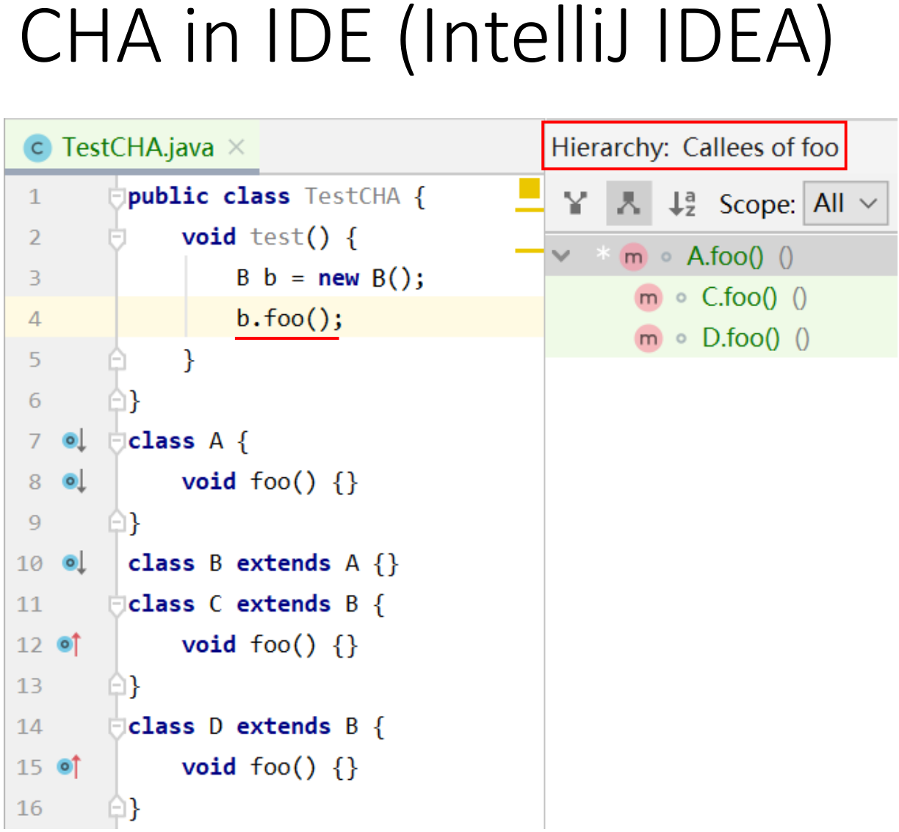

CHA的实际思路和算法。

## Call Graph Construction

### Idea

-   Build call graph for whole program via CHA
-   Start from entry methods (focus on main method)
-   For each reachable method 𝑚, resolve target methods for each call site 𝑐𝑠 in 𝑚 via CHA (Resolve(𝑐𝑠))
-   Repeat until no new method is discovered

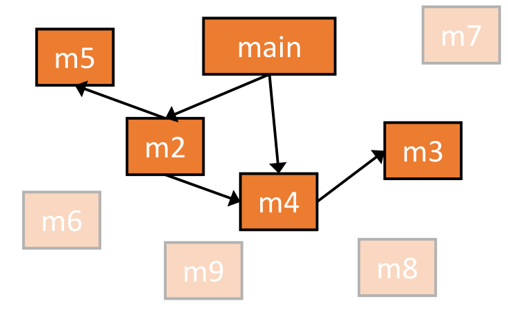

### Algorithm

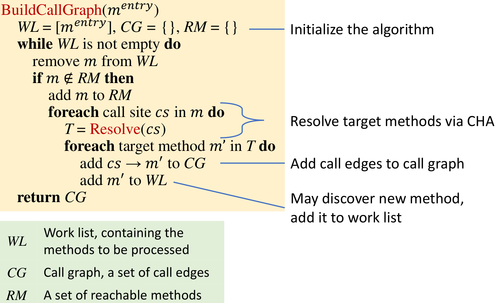

-   Worklist记录需要处理的methods
-   Call graph是需要构建的目标，是call edges的集合
-   Reachable method是已经处理过的目标，在Worklist中取新目标时，不需要再次处理已经在RM中的目标

### Example

1.  初始化
2.  处理main后向WL中加入A.foo()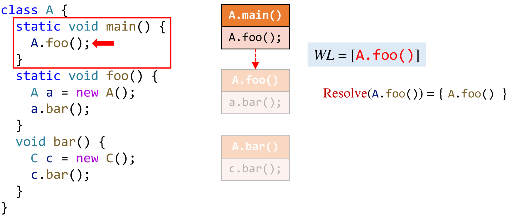
3.  中间省略一些步骤，这里面对C.bar()时，虽然会调用A.foo()，但由于A.foo()之前已经处理过（在集合RM中），之后不会再进行处理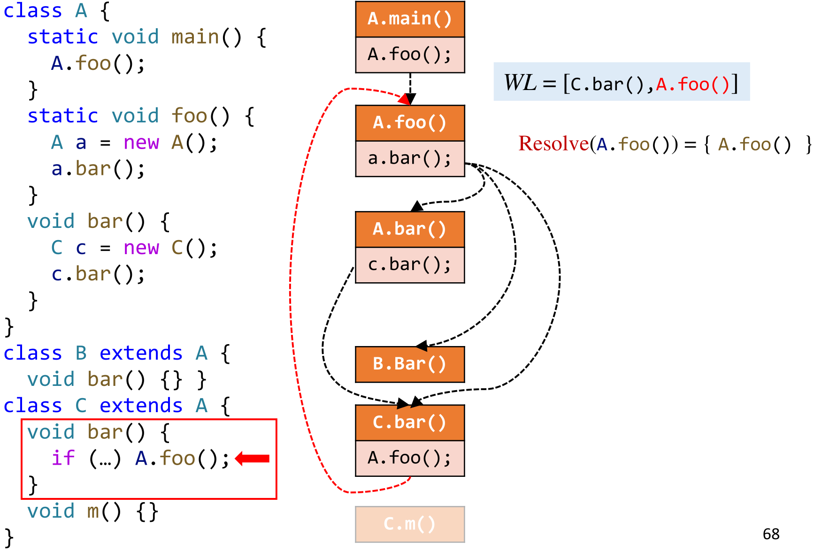
4.  这里C.m()是不可达的死代码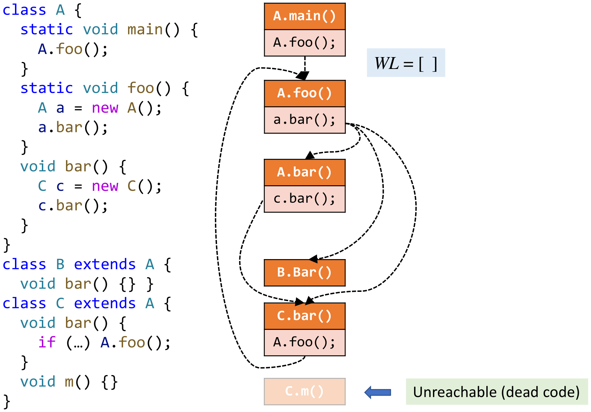

*注：忽略new A()对构造函数的调用，这不是例子的重点。*

**这个例子是对本小节的总结，如果不能读懂并独立推导建议重读一遍。**

## Interprocedural Control-Flow Graph

>   ICFG = CFG+call & return edges

ICFG可以通过CFG加上两种边构造得到。

1.  Call edges: from call sites to the entry nodes of their callees
2.  Return edges: from return statements of the callees to the statements following their call sites (i.e., return sites)

例如：

# Interprocedural Data-Flow Analysis

## 定义与比较

目前这一分析领域没有标准方法。首先对过程间和过程内的分析做一个对比，并以常量传播为例子进行解释。

Edge transfer处理引入的call & return edge。

-   Call edge transfer
    -   transfer data flow from call node to the 
        entry node of callee (along call edges)
    -   传递参数
-   Return edge transfer
    -   transfer data flow from return node of 
        the callee to the return site (along return edges)
    -   传递返回值
-   Node transfer
    -   Same as intra-procedural constant propagation, 
        plus: for each call node, kill data-flow value for the LHS(Left hand side) variable. Its value will flow to return site along the return edges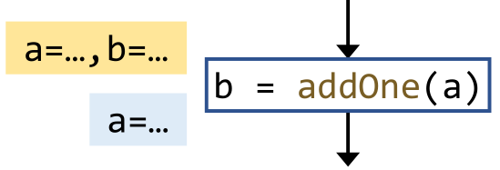

## Example

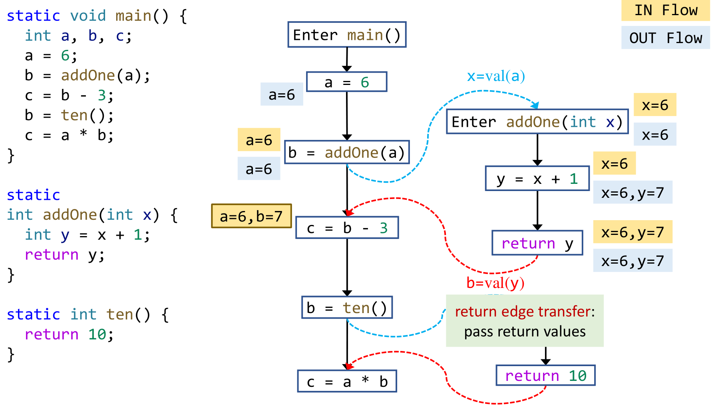

### 小问题

<u>这一段有存在的必要吗？</u>

> Such edge (from call site to return site) is named call-to-return edge. It allows the analysis to propagate local data-flow (a=6 in this case) on ICFG.

如果没有这一段，那么a就得“出国”去浪费地球资源——在分析被调用函数的全程中都需要记住a的值，这在程序运行时会浪费大量内存。

要记得在调用语句处kill掉表达式左边的值，否则会造成结果的不准确，如：

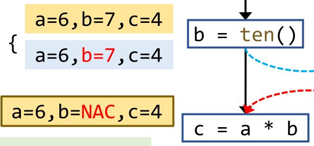

# 过程间分析有多重要？

讲到这里，我们回到故事的开头，看看过程间分析的引入到底能带来多大的精度提高吧。上述例子应用过程间分析的完整推导如下：

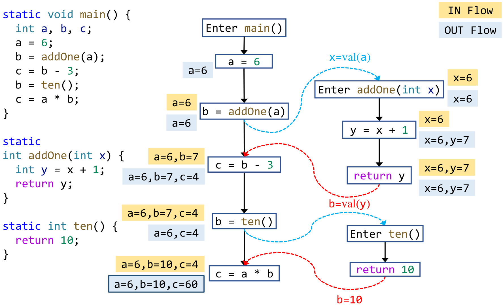

而如果只做过程内分析，则**精度大大下降**：

# Sum up

1.  How to build call graph via class hierarchy analysis
2.  Concept of interprocedural control-flow graph
3.  Concept of interprocedural data-flow analysis
4.  Interprocedural constant propagation