# Security

>   前面的课程相当tough。~~今天来讲些简单有趣的内容。~~

# Introduction

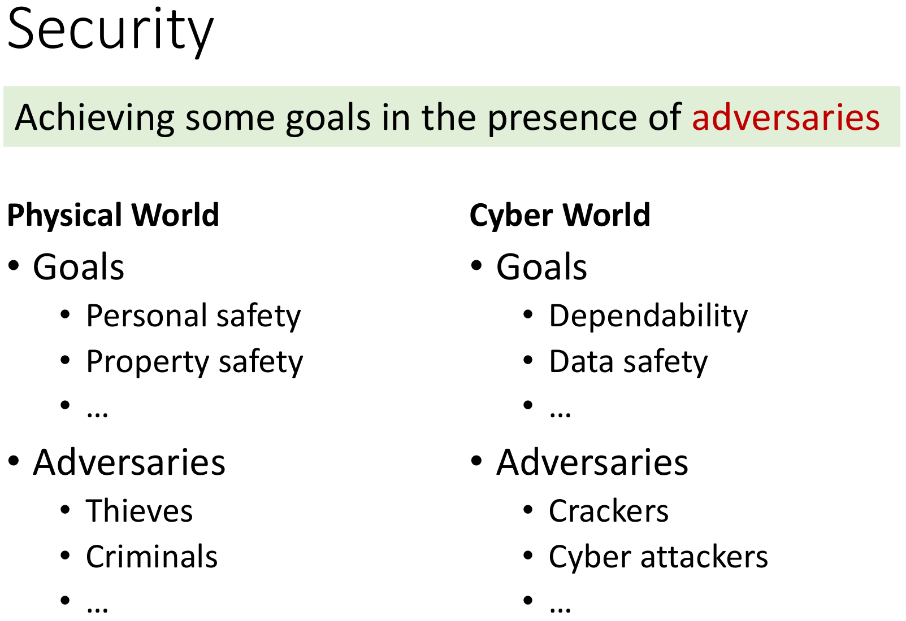

尽管Computer Security在信息化的当代已经很重要了，但它依然越来越重要。如果你不注重它，就会[这样](https://www.7pay.co.jp)……

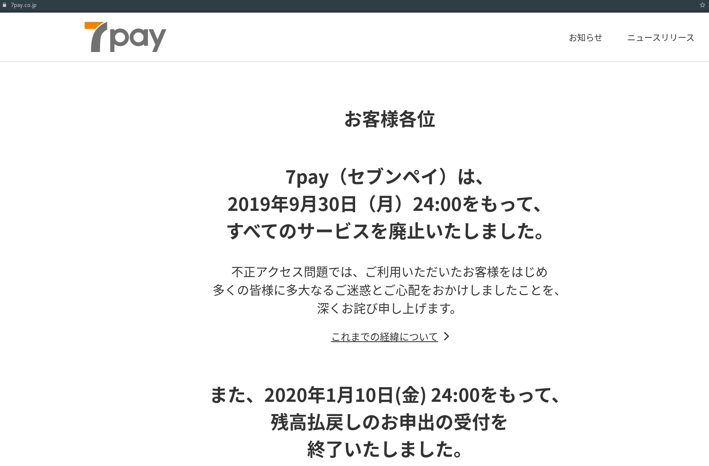

我们接下来要讨论的问题，在[The Open Web Application Security Project® (OWASP)](https://owasp.org/)和[National Vulnerability Database](https://nvd.nist.gov/)近年所公布的网络安全议题中占据高位。它们是：

-   Injection errors
-   Information leaks 

---

本课内容安排如下：

1. Information Flow Security
2. Confidentiality and Integrity
3. Explicit Flows and Covert Channels
4. Taint Analysis

# Information Flow Security

## Access Control vs. Information Flow Security

>   "A practical system needs both access and flow control to satisfy all security requirements."
>
>   ​																				--D. Denning, 1976

-   Access Control concerns how information is **accessed**.
-   Information Flow Security concerns how information is **propagated**.

## Information Flow

 If the information in variable x is transferred to variable y, then there is information flow x->y.

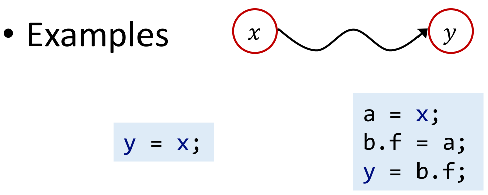

### Information Flow Security

Connects information flow to security

-   Classifies program variables into different **security level**
    -   为变量定出安全等级。可以类比Linux中的用户权限管理，如root用户和普通用户。
-   Specifies permissible flows between these levels, i.e., information flow policy
    -   然后设定信息流政策。比如Linux中的root用户可以做一切事情，而普通用户不可能访问root用户专有的文件和文件夹。

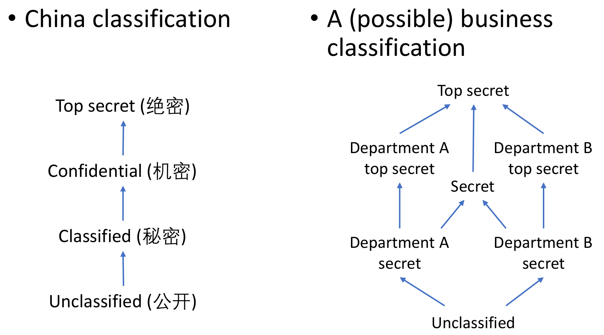

### Information Flow Policy

一种常用的策略是Noninterference policy——高秘密等级的信息不应该影响到低秘密等级的信息。这能够保证攻击者无法通过观测低秘密等级的信息推测出和高秘密等级的信息。

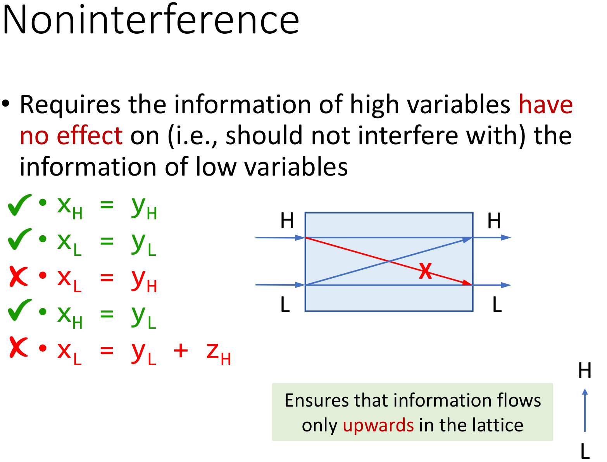

关于最后一个行：只要攻击者知道了低秘密等级的x和y的值，就能反推出高秘密等级的z的值。因此这样的赋值不应该被允许。

# Confidentiality and Integrity

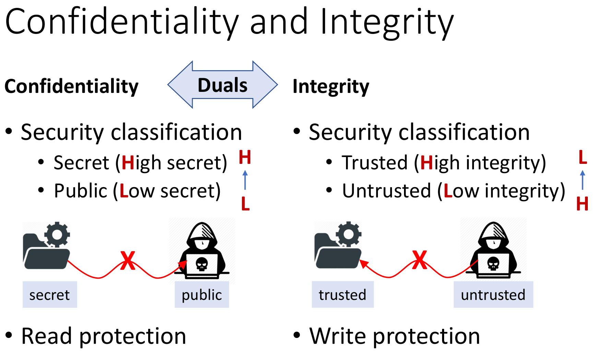

-   Confidentiality(在信息流安全的语境中)侧重于防止攻击者获取到机密信息，**即保护关键数据不被攻击者读取**。
-   Integrity(在信息流安全的语境中)侧重于防止攻击者通过恶意提权或SQL注入等手段执行了高执行权限的命令，**即保护关键数据不被攻击者写入。**

More on Integrity-a Board Definition(在信息流安全以外的语境中，Integrity有更多的含义):

>   To ensure the correctness, completeness, and consistency of data. 

-   Correctness
    -   E.g., for information flow integrity, the (trusted) critical data should not be corrupted by untrusted data
-   Completeness
    -   E.g., a database system should store all data ompletely
-   Consistency
    -   E.g., a file transfer system should ensure that the file contents 


# Explicit Flows and Covert Channels

信息在程序中流动的两种方式——显式流和隐藏信道。

### Explicit Flows

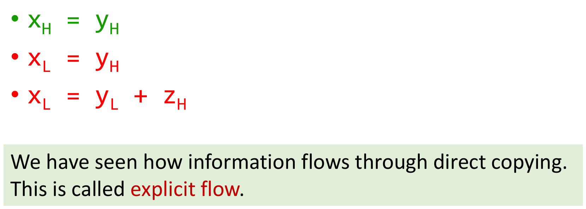

### Covert Channels

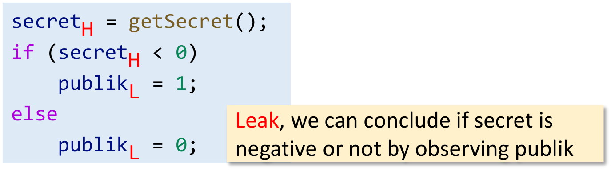

-   This kind of information flow is called implicit flow, which **may arise when the control flow is affected by secret information**.
-   Any differences in side effects under **secret control** encode information about the control, which may be **publicly observable** and leak secret information.

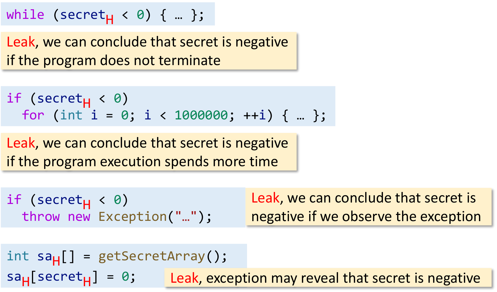

-   Mechanisms for signalling information through a computing system are known as **channels**.
    -   信道传输信息。
-   Channels that exploit a mechanism whose primary purpose is not information transfer are called **covert channels**.
    -   原本的目的不是传递信息，却传递了信息的信道，我们就称之为隐藏信道。

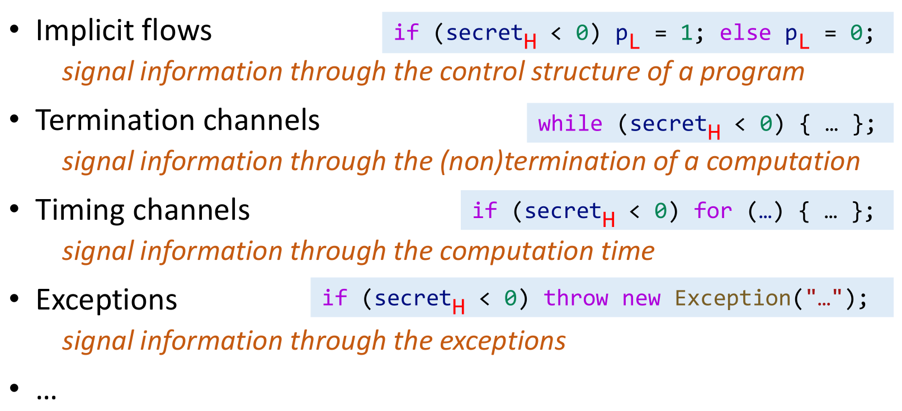

More:

-   通过观察电量消耗、网络流量特征、缓存命中率、服务器响应时长特征，都能以某种方式获得某种程度的机密信息。

-   Side Channel: "AF缺乏淡水"

    -   在电影《中途岛海战》中，有这样一段对话，大意如下：

    >   "你不知道酒宴将在哪里举行，但你能发现酒店被预定，酒水被集中运到某个地点……"

不过，还是有好消息的：

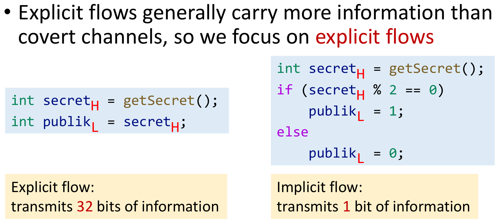


# Taint Analysis

## Definition

类比于同位素标记，我们通过给关心的数据打上标记，而把数据分为tainted/untainted data.

接着我们定义Source和Sink：

-   **<u>Sources of tainted data</u> is called sources.** In practice, tainted data usually come from the return values of some methods (regarded as sources).
-   **Taint analysis tracks how tainted data flow through the program and observes if they can flow to <u>locations of interest</u> (called sinks).** In practice, sinks are usually some sensitive methods.

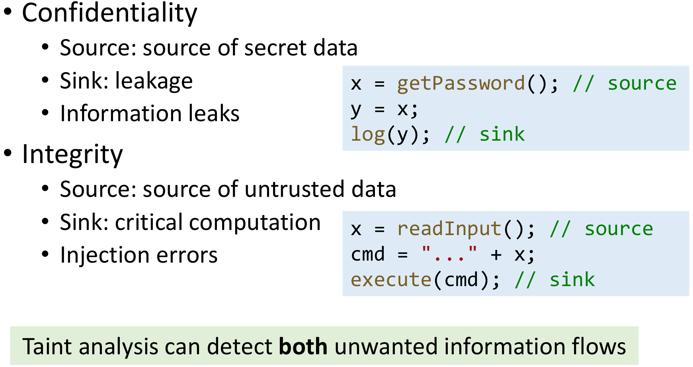

---

## Taint & Pointer Analysis, Together

>   等等等等，我们不是来学静态程序分析的吗？

“Can tainted data flow to a sink?”换一种问法其实就是“Which tainted data a pointer (at a sink) can point to?”

所以之前学过的指针分析就有了用武之地：

-   Treats tainted data as (artificial) **objects**
-   Treats sources as **allocation sites** (of tainted data)
-   Leverages pointer analysis to **propagate** tainted data

### Domains & Notations

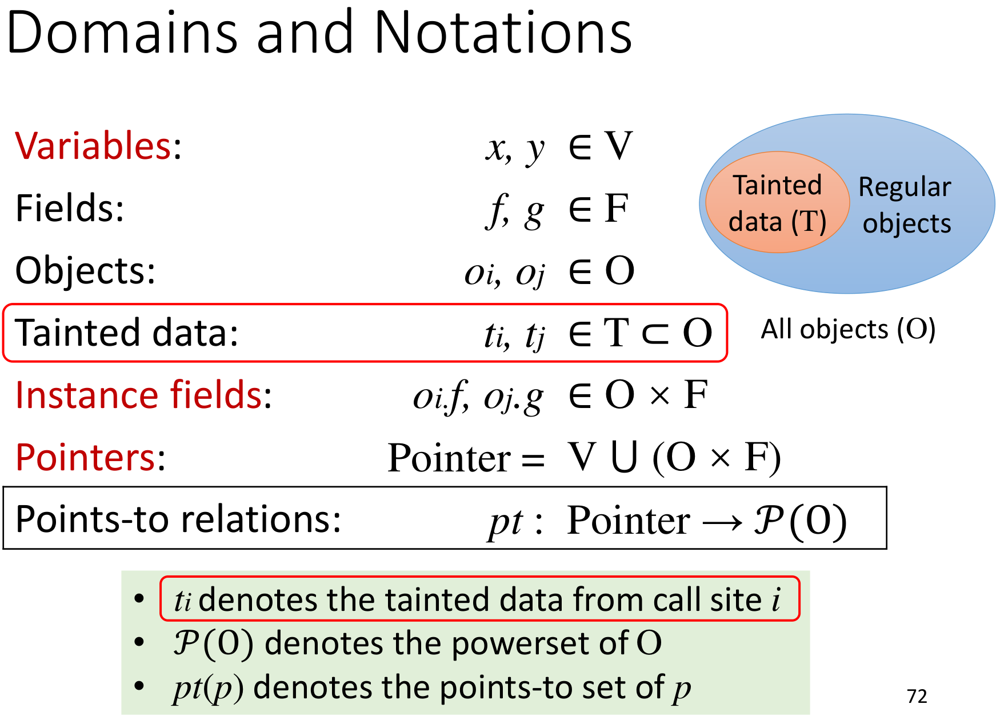

我们在Domain中添加Tainted data。和之前一样，用下标的i和j标识data产生的位置。

### Inputs & Outputs

**Inputs**

-   **𝑆𝑜𝑢𝑟𝑐𝑒𝑠**: a set of source methods (the calls to these methods return tainted data)
-   **𝑆𝑖𝑛𝑘𝑠**: a set of sink methods (that tainted data flow to these 
    methods violates security polices)

**Outputs**

-   **𝑇𝑎𝑖𝑛𝑡𝐹𝑙𝑜𝑤𝑠**: a set of pairs of tainted data and sink methods
    -   E.g., $$ (𝑡_𝑖, 𝑚)\in$$ 𝑇𝑎𝑖𝑛𝑡𝐹𝑙𝑜𝑤𝑠 denotes that the tainted data from call site 𝑖 (which calls a source method) may flow to sink method 𝑚

### Rules

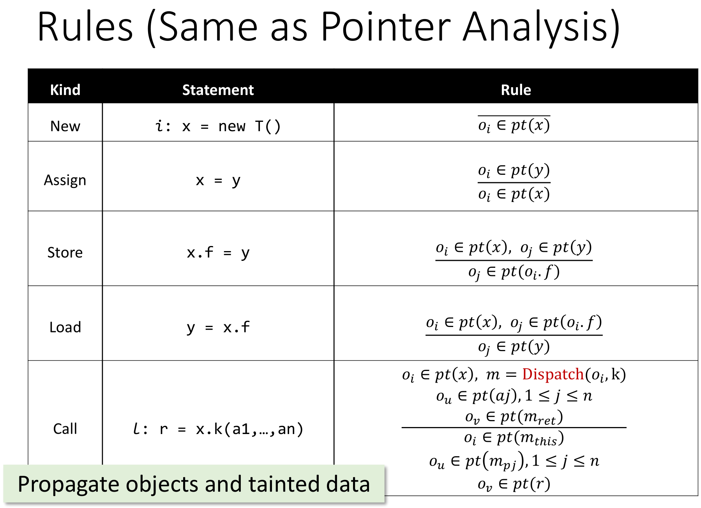

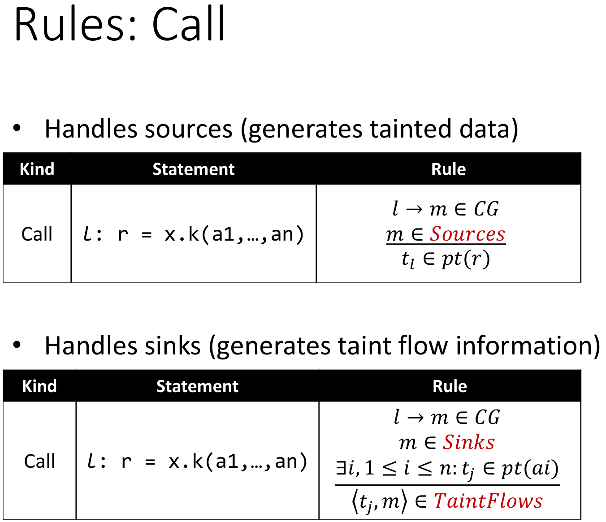

### Example

假设我们这样定义Source为`getPassword()`方法，Sink为`log(String)`方法。试着分析以下代码，看看输出指向关系和TaintFlows集合应该是什么？

>   我们不希望有Sources->Sinks的信息流。先考虑一下动态执行时会发生什么事情？

```java
void main() {
    A x = new A(); 
    String pw = getPassword();
    A y = x;
    x.f = pw;
    String s = y.f;
    log(s);
    // 这个log会写下什么惊人的东西吗？
}
String getPassword() {
	return new String(…);
}
class A {
	String f;
}
```

~~过程在咕咕咕的视频讲解中。~~

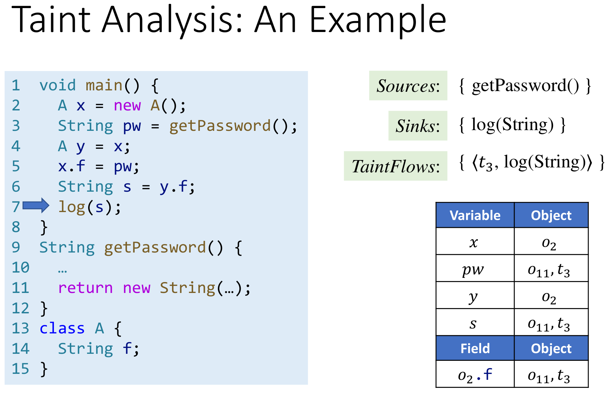

## Key Points

1.  **Concept** of information flow security
2.  **Confidentiality & integrity**
3.  **Explicit** flows & **covert** channels
4.  Use **taint analysis** to detect unwanted information flow
