# Datalog-Based Program Analysis

Datalog是一种命令式（Declarative）的编程语言。

主要内容如下：

1.  Motivation
2.  Introduction to Datalog
3.  Pointer Analysis via Datalog
4.  Taint Analysis via Datalog

# Motivation

如果用Imperative的编程方式做指针分析，很麻烦。


而如果用Declarative的方式做编程分析，能够极大地简化实现。


# Introduction to Datalog

接下来学习一个船新的语言——Datalog，它实际上是大名鼎鼎的Prolog的一个子集。

`Datalog=Data+Logic(and,or,not)`

-   没有副作用
-   没有控制流
-   没有函数
-   不是图灵完备的

## Data

### Predicates

谓词(Predicates)是datalog中的一个主要组成部分，可以看作是数据所组成的一个表(table of data)，每一行都代表一个事实(fact)。例如：

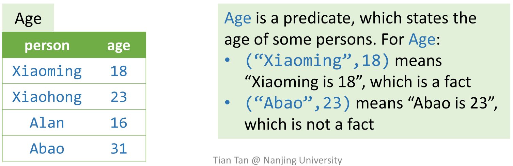

### Atoms

原子(Atoms)是Datalog中的基本元素，组成和例子如下：


Atoms可以分成两类

-   Relational Atoms

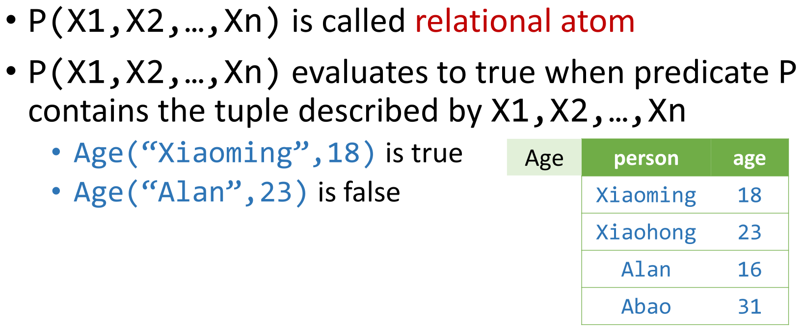

-   Arithmetic Atoms
    -   如`age >= 18`

## Logic

### Datalog Rules & Logic And

Datalog使用规则来进行推导(inference)，其定义如下：

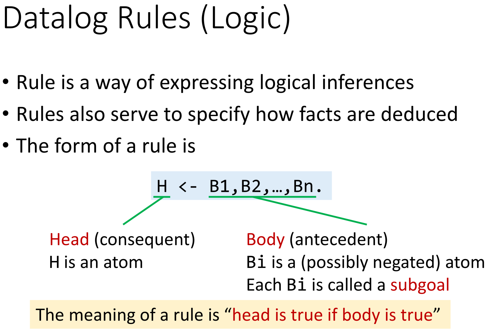

当Body中的所有表达式都为True时，Head才为True，如：

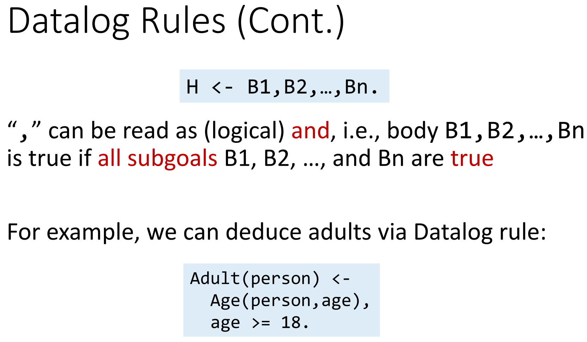

求解过程(Interpretation of Datalog Rules)——枚举Body中所有关系表达式的可能取值组合，进而得到新的predicate/table。例如：

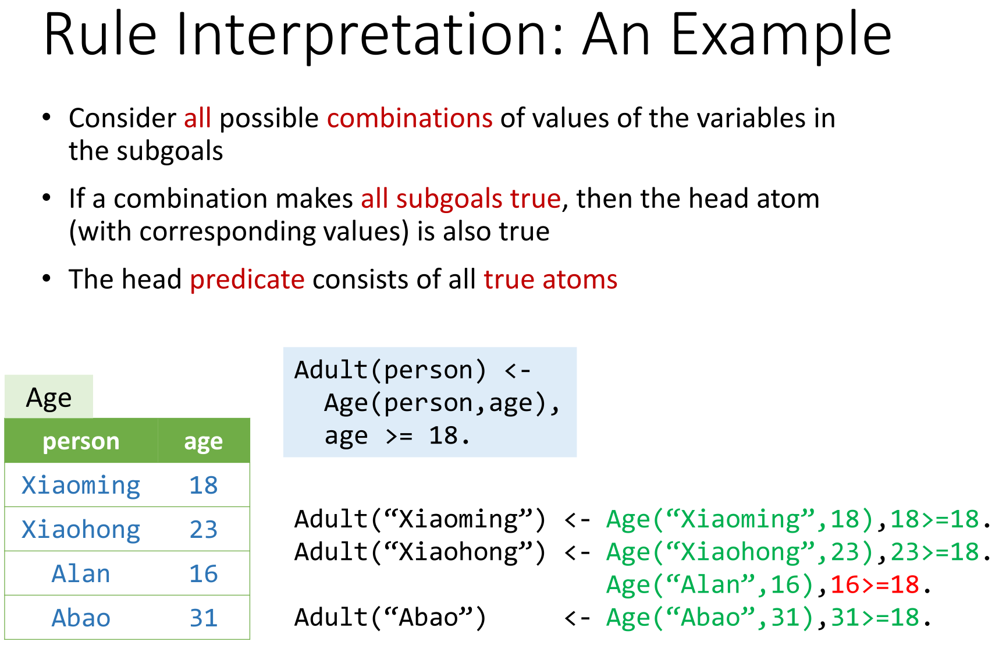

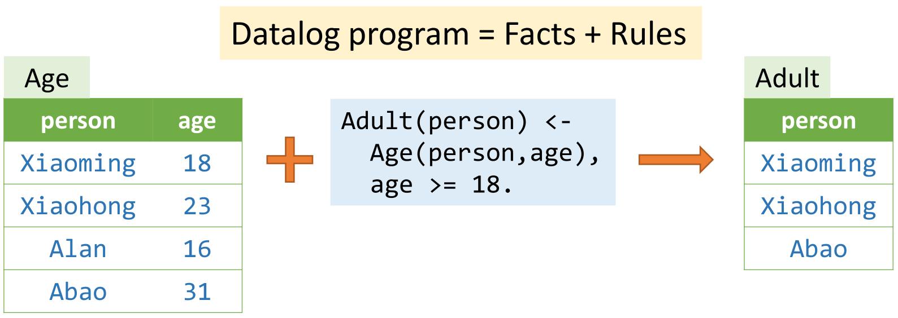

谓词分为两类：EDB & IDB。

-   EDB (extensional database)
    -   在程序运行前，这些数据已经给定
-   IDB (intensional database)
    -   这一类数据仅由规则推导得来

例如：

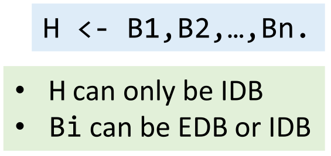

### Logic Or

以上例子实际上是逻辑与，而逻辑或则有两种实现方式：


此外还需要考虑运算优先级的问题，建议在书写程序时用括号明确地标识期望的运算优先级：`H<-A,(B;C)`。

### Logic Not/Negation

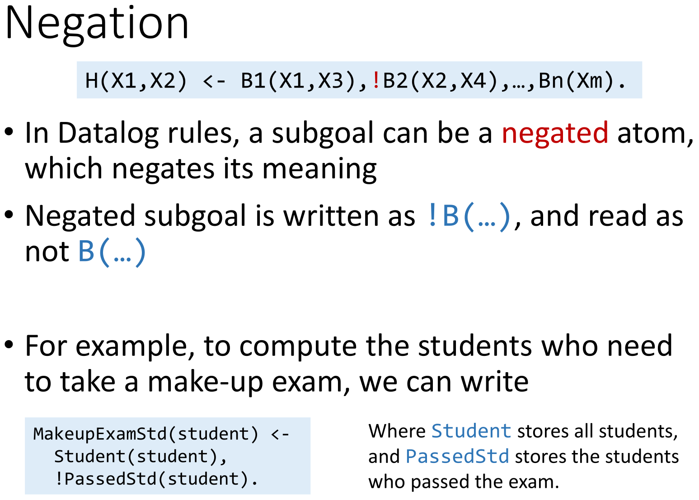

### Recursion


## Rule Satety

讲到这里，停下来思考一下，这两条Rules看起来有什么问题吗？

-   `A(x) <- B(y), x > y.`
-   `A(x) <- B(y), !C(x,y).`


~~第一次学看不出问题也没问题的~~

由于x有无限的取值能满足规则，所以**生成的A是一个无限大的关系**。因此上述两条规则是不安全的。在Datalog中，只接受安全的规则。

这里我们需要记住一个判定的准则：**如果规则中的每个变量至少在一个non-nageted <u>relational atom</u>中出现一次，那么这个规则是安全的**。

*这实际上是借助已有的predicates（它们必定是有限的）来限制变量的取值范围。*

---

类似地，还有这样的规则：

`A(x) <- B(x), !A(x)`

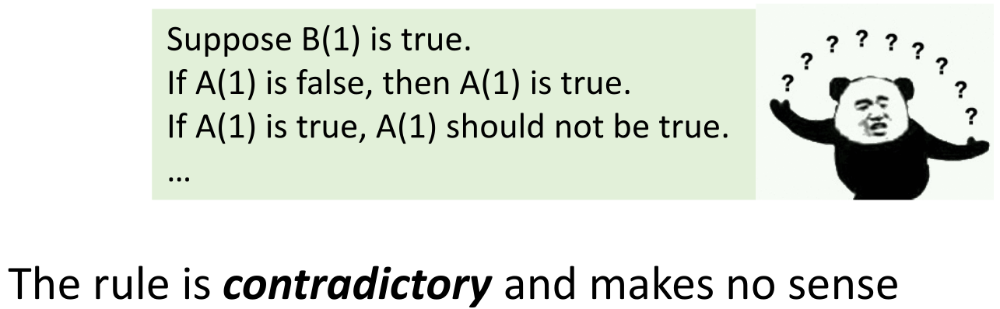

对应地有第二个准则：**不要把recursion和negation写在同一条规则里**，*即避免写出非A推导出A这样的规则*。

## Execution of Datalog Program

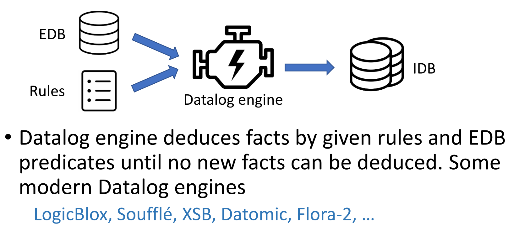

Datalog的两大重要特性：

-   单调性。因为事实（facts）不会被删除的。
-   必然终止。
    -   事实的数量是**单调**的。
    -   由Rule Safety，所能得到的IDB的大小也是**有限**的。

# Pointer Analysis via Datalog

了解了Datalog的基本语法和性质，我们就可以用它来实现声明式的指针分析算法。其中三个重要的部分对应如下：

-   EDB：从程序的语义分析中能得到的与指针相关的信息
-   IDB：指针分析的结果
-   Rules：指针分析的规则


和之前一样，我们把Call放到最后处理。

## Datalog Model-EDB&IDB

我们首先需要对前四条语句建模。输入的EDB代表了4个存储相应类型语句的table，输出为Variable和Field的指向关系。


一个关于EDB的例子如下：

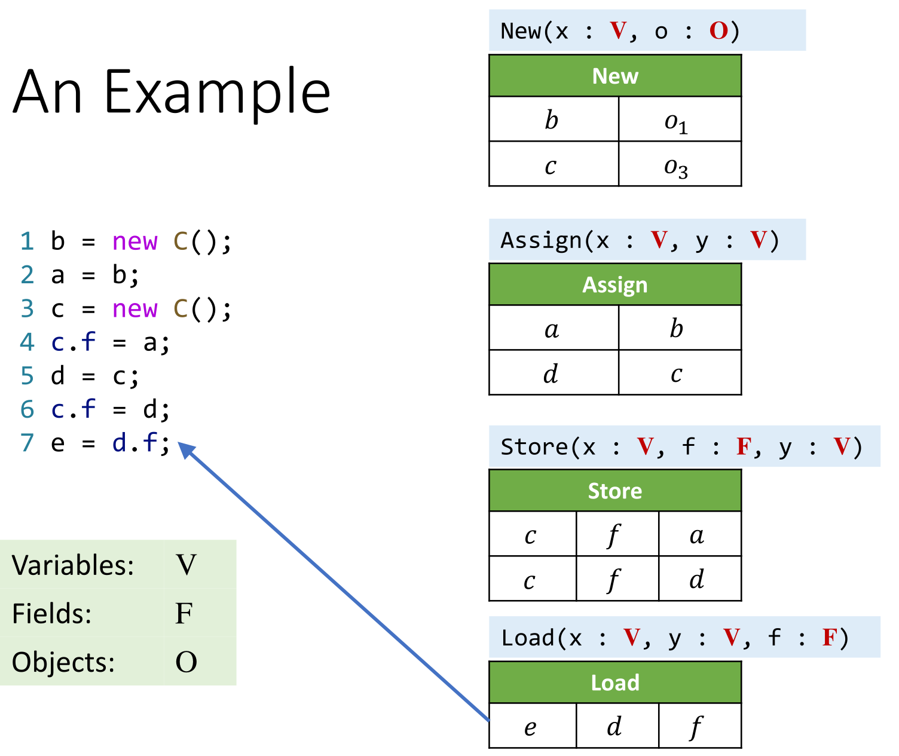

## Datalog Rules

Body按照红线所示代表前提，Head按照蓝线所示代表结论。


## Example 

利用刚刚讲解的算法和Datalog的执行规则，分析这一段代码，给出推导结束后的IDB。

```java
b = new C();
a = b;
c = new C();
c.f = a;
d = c;
c.f = d;
e = d.f;
```

结果如下：

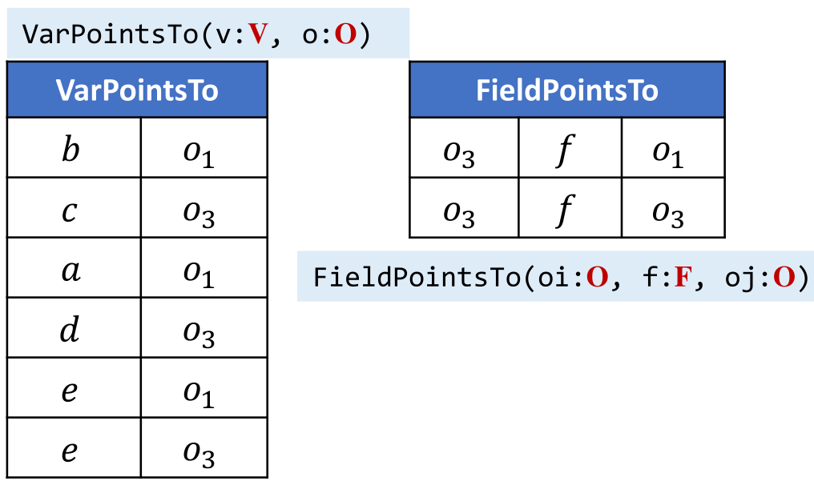

## PA with Calls

回顾指针分析中Call的规则：

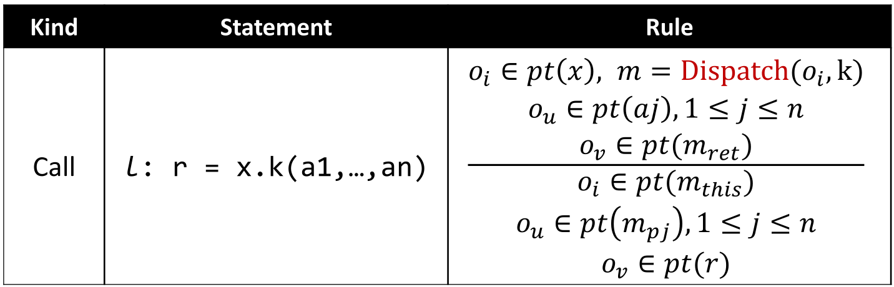

### This

首先，我们需要引入新的EDB和IDB：

（VCall即Virtual Call，ThisVar即This Variable）

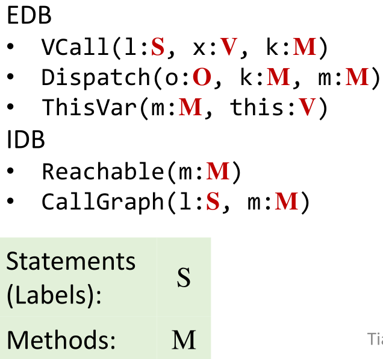

我们能够同时知道三个信息：

1.  this指向对象o
2.  方法m是可达的
3.  方法m可达是因为在l行处存在对方法m的调用

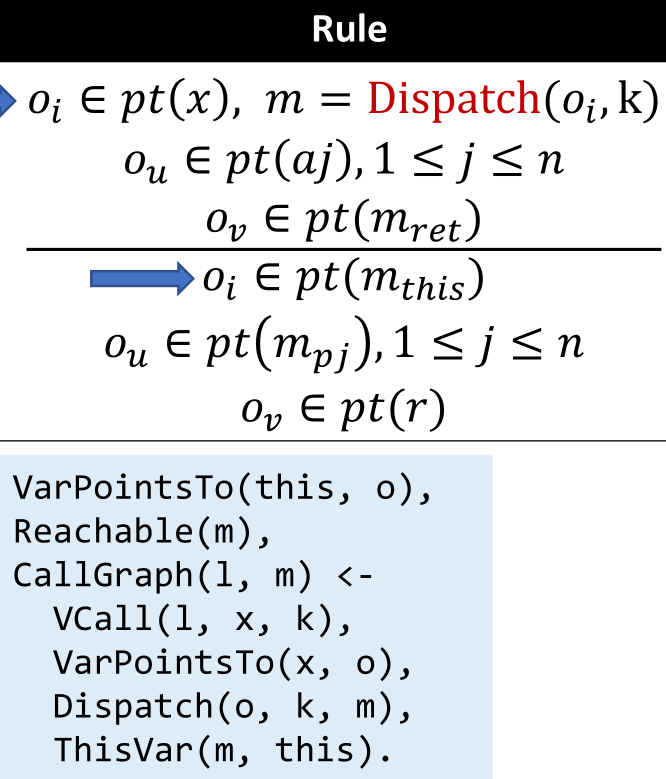

### Parameters

接下来要处理参数的传递，与之前类似，引入EDB标识Argument(调用语句行号，参数标号和参数本身)和Parameter(被调用方法，参数标号和参数本身)：

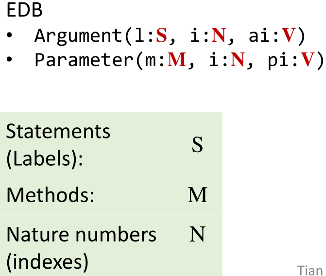

而对应用Datalog书写的规则如果用自然语言描述，就是处理行号l处对m的调用时，根据形参和实参的信息，将实参已经有的指向关系传递给形参数。


### Return Value

引入EDB：


对应的Datalog Rule，处理返回值的指向关系：


### Sum up

以上三个部分总结起来，就能得到以下的Datalog Rules。

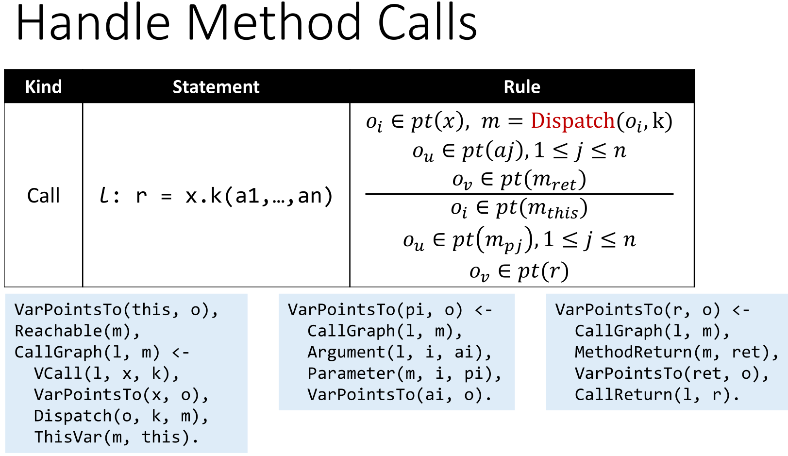

进而能得到全程序的分析算法如下。值得一提的是，在VarPointsTo规则中，添加Reachable(m)跳过不可达方法中的对象。而其他规则不需要加这一条件，则是因为它们都有VarPointsTo规则作为Body的一部分。


# Taint Analysis via Datalog

## Datalog Model

同样需要用户提供Source和Sink。输出被标记的数据可能流到的Sink方法。

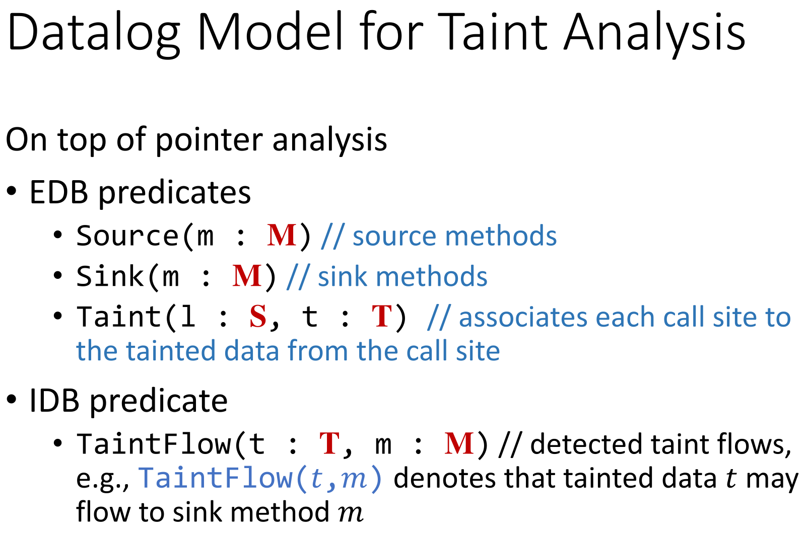

## Datalog Rules

说明：这里参数列表中用`—`表示通配符，即不关心枚举时这个位置取什么值。

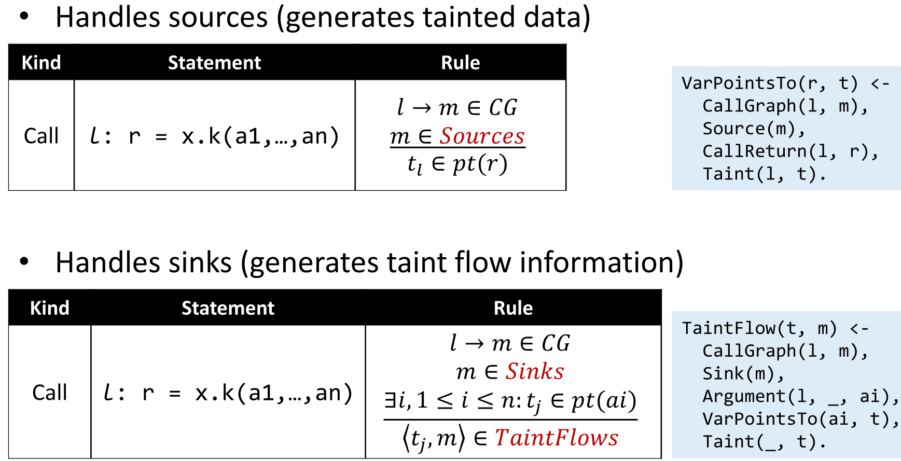

# Key Points

-   Pros
    -   **Succinct** and **readable**
    -   **Easy** to implement
    -   **Benefit from off-the-shelf optimized Datalog engines**
-   Cons
    -   **Restricted expressiveness**, i.e., it is impossible or inconvenient to express some logics
    -   Cannot fully control **performance**
-   Overall Review
    -   **Datalog** language
    -   How to implement **pointer analysis via Datalog**
    -   How to implement **taint analysis via Datalog**
