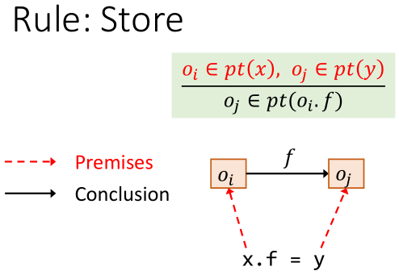
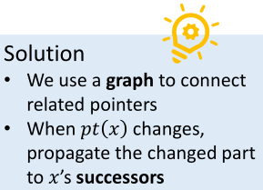
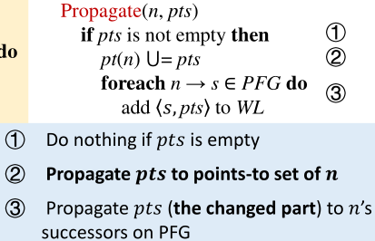
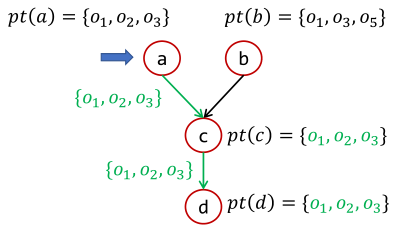
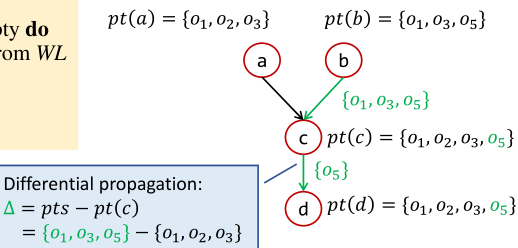
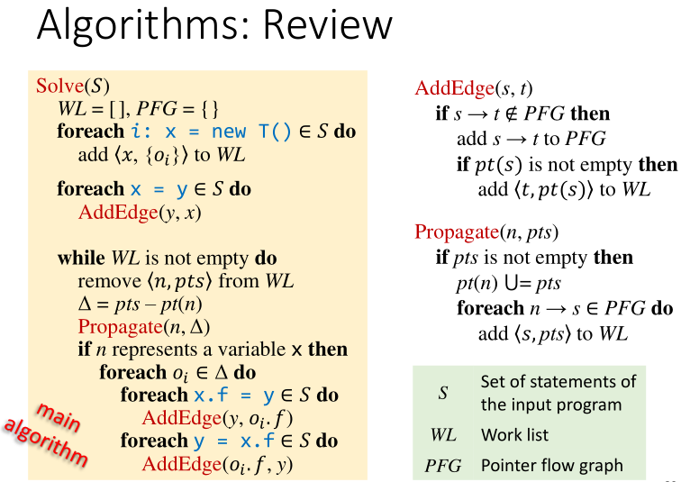

# 指针分析二

1. Pointer Analysis: Rules
2. How to Implement Pointer Analysis
3. Pointer Analysis: Algorithms
4. Pointer Analysis with Method Calls


首先介绍常用数学符号，不会的同学可以复习一下离散数学。


分别定义变量，域，对象（用下标标识是在第几行创建的对象），实例域和指针（是变量和实例对象的并），和指向关系。`X`表示笛卡尔积。

pt(p)代表的是指针p可能指向的对象。如

```cpp
if(...){
    x = new A()
} else {
    x = new B()
}
```

# Pointer Analysis: Rules

<u>*前排提示：与《数理逻辑》/《形式化语义》梦幻联动。没学过的同学也不要着急。*</u>


主要解释Rule一列中的内容。**横线上的内容是前提(Premises)，横线下的内容是结论(Conclusion)。**

用简单易懂的语言描述，看到new语句，我们就将新建的对象加入`pt(x)`。


对于Assign语句，我们将x指向y指向的对象。


对于Store和Load亦然。




## Summary

最后用一图总结。**第一条规则添加指向，而后三条规则传递指向关系。**


# How to Implement Pointer Analysis

*<u>别处的资料都没有全家桶，只介绍某些特殊情况下的分析算法。在这里你能喜提一个完整的指针分析算法全家桶。</u>*

本质上来说，指针分析是在指针间**传递**指向关系。


inclusion constraints的具体解释：在上述表示的结论部分中可以写作两个集合间的包含关系。如Load应该表示为：

-   前提：`y=x.f`和$o_i \in pt(x)$
-   结论：$pt(o_i.f) \subset pt(y)$

>   ​	Key to implementation: when 𝑝𝑡(𝑥)is **changed**, **propagate** the **changed par**t to the **related pointers** of 𝑥



## Pointer Flow Graph

>   Pointer Flow Graph (PFG) of a program is a directed graph  
>   that expresses how objects flow among the pointers in the program.

为了实现指针分析，我们首先了解与之密切相关的数据结构——指针流图。

图的两大要素是Node和Edge。我们定义：

-   `Node: Pointer = V ⋃ (O × F)`
    -   A node n represents **a variable** or **a field of an abstract object**
-   `Edges: Pointer × Pointer`
    -   **An edge 𝑥 -> 𝑦** means that the objects pointed by pointer 𝑥 **may flow to (and also be pointed to by)** pointer 𝑦


## Example

假设c和d一开始都指向`oi`。根据上述规则，我们能够从左侧的程序语句从上到下构建出右侧的指针流图。


因此，所有b所指向的对象更新时，都要传递到e中。这是一个求传递闭包(transitive closure)的过程。假如我们考虑j位置的一条新语句`b = new T();`：


PFG的整个构造过程，需要在构建PFG和在已有的PFG上传递指向关系这两个步骤间循环往复。


# Pointer Analysis: Algorithms

## Introduction to algorithm

-   由于做流不敏感分析。输入为Set，丢失了语句的顺序关系也没关系。
-   WorkList：保存接下来要处理的指向信息，与BFS中的队列作用类似。
    -   Each worklist entry 𝑛, 𝑝𝑡𝑠 is a pair of pointer 𝑛 and points-to set 𝑝𝑡𝑠, which means that 𝑝𝑡𝑠 should be propagated to 𝑝𝑡(𝑛)
    -   E.g., `[(𝑥,{𝑜𝑖}), (𝑦,{𝑜𝑗, 𝑜𝑘}), (𝑜𝑗.𝑓, {𝑜𝑙})...]`

首先看四个红框，对应指针分析的四种基本语句。

## Handling of New and Assign

### Init and adding edges


首先考虑两种简单的语句：New和Assign。

-   前三行代码做初始化的工作，并针对所有的**New**语句，将所有的初始指向关系加入WorkList。
-   之后的两行代码处理**Assign**语句，添加`y->x`的边到PFG中。添加边的具体算法如下


###  Propagate


传播的具体算法如下，标号为2的语句是整个算法中唯一执行后改变指向关系的语句。



### Trick-Differential Propagation

在真实的指针分析中，对象的数量非常巨大（上亿），我们通过Differential Propagation来消除冗余。

```cpp
Solve(𝑆)
    ...
    while WL is not empty do
        remove 𝑛, 𝑝𝑡𝑠 from WL
        Δ = pts – pt(n) // Differential Propagation
        Propagate(n, Δ) // Differential Propagation
```






-   In practice, Δ is usually small compared with the original set, so propagating only the new points-to information (Δ) 
-   Besides, Δ is also important for efficiency when handling stores, loads, and method calls, as explained later

## Handling Store and Load


对于AddEdge函数中第二个if的说明：仅在第一次添加s->t到PFG时添加pt(s)的信息到t，是因为Propagate中的语句能够处理后续的pt(s)变化。

## The Algorithm-Review

至此，我们完整地介绍了为了教学目的设计的指针分析算法。



## Example

这一例子动态内容很多，所以计划录制一小段视频讲解。

# Key points

**The X You Need To Understand in This Lecture**

-   Understand pointer analysis rules
-   Understand pointer flow graph
-   Understand pointer analysis algorithms


# Pointer Analysis with Method Calls

*To be continue...*
