# Soundiness

在时间中很难实现sound的算法，所以专家们提出一个与Soundness不同的概念Soundiness。（关于Soundness，可以回顾B站上的前两节课）。

本文主要内容如下：

1. Soundness and Soundiness
2. Hard Language Feature: Java Reflection
3. Hard Language Feature: Native Code

# Soundness and Soundiness

回顾Soundness的定义(没有漏报bug就是sound)：

>   **Conservative** approximation: the analysis **captures all program behaviors**, or the analysis result **models all possible executions** of the program.

无论是学术界还是工业界的算法，都是不完全sound的。

这是由于很多语言拥有的部分高级特性对于静态分析来说是难以分析的：

-   Java
    -   Reflection, native code, dynamic class loading, etc.
-   JavaScript
    -   eval, document object model (DOM), etc.
-   C/C++
    -   Pointer arithmetic, function pointers, etc.

例如对C/C++中的一个指针p，加上某个经过运算的偏移量x，为了分析的安全，只能假设p+x可以指向内存中的任何一个地方。

为了解决这一问题，专家们提出一个新的概念Soundiness，对应的形容词是Soundy。

>   A **soundy** analysis typically means that the analysis is mostly sound, with **well-identified** unsound treatments to hard/specific language features.

把新旧词汇放到一起做个比较：

-   A **sound** analysis requires to **capture all** dynamic behaviors
    -   完全理想情况
-   A **soundy** analysis aims to **capture all** dynamic behaviors **with certain hard language features unsoundly handled within reason**
    -   现实情况
-   An **unsound** analysis **deliberately ignores certain behaviors in its design for better efficiency, precision or accessibility**
    -   过于现实的情况

# Hard Language Feature: Java Reflection

说了这么多抽象的概念，接下来具体说说在Java里给静态分析添乱的特性。

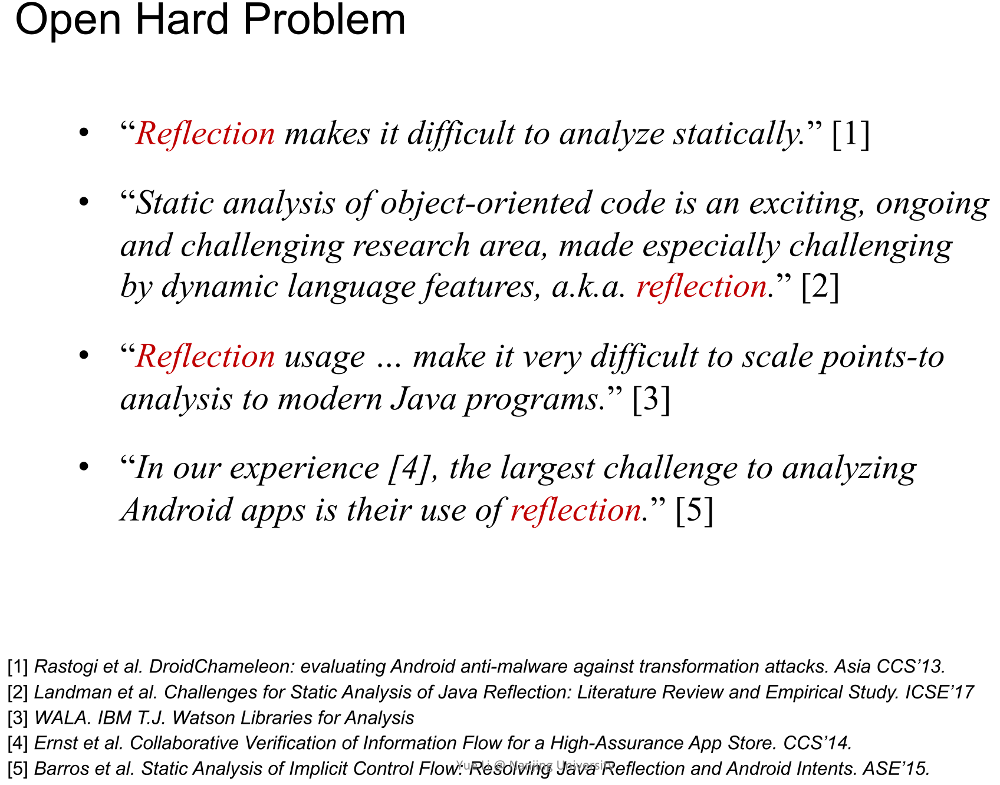

## Java Reflection

首先，右上角Run-time代码块中的前三行的Class、Method和Field都是Metaobject。然后就能够以Metaobject执行一系列操作，如`c.newInstance()`就相当于左下角的`new Person()`。

使用Reflection时，无法在编译时确定其行为，只能在运行时确定。

## Why Analyze It

可能会**错失检测出某些bug的机会**(忽略`m.invoke`所引入的调用时发生)，也可能**导致分析的结果不安全**(忽略`f.set(a,a)`的作用时发生，将会错误地认为箭头指向处的cast可以优化掉)。

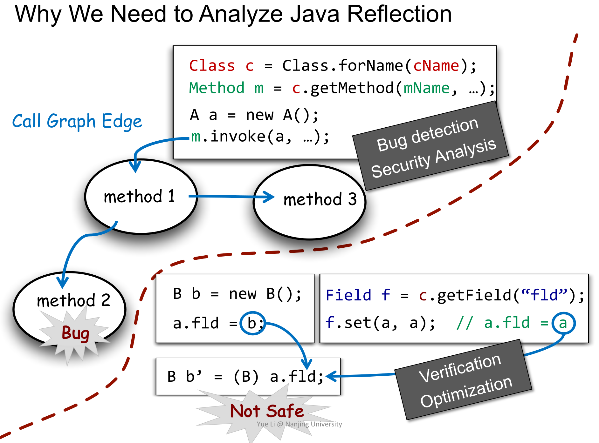

## How to Analyze It

一种方法是模拟动态运行过程，只要知道关键调用时的字符串，就能分析出结果：

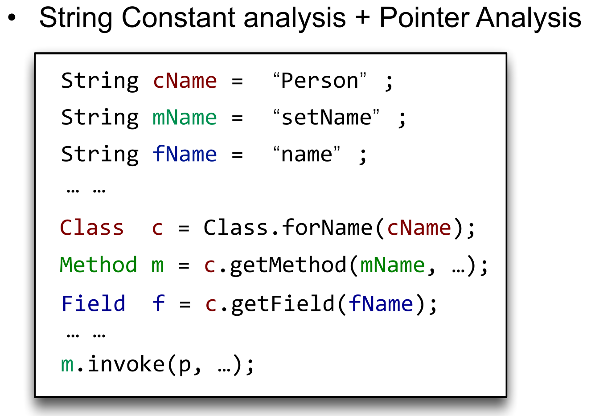

**吗？**

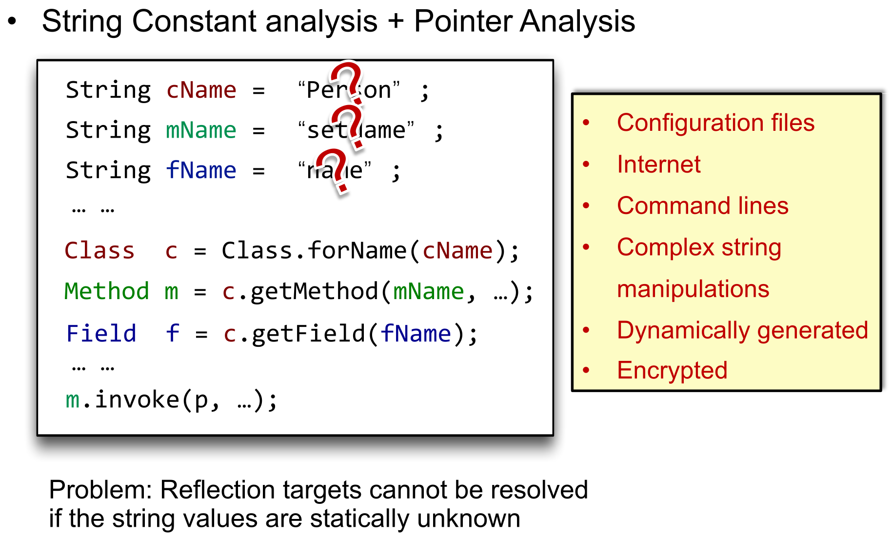

因为有太多的因素(见右边黄框内容)可能会影响到字符串的值，而其中很多是无法静态确定的。基于字符串常量的分析此时并不奏效……

## Real research paper

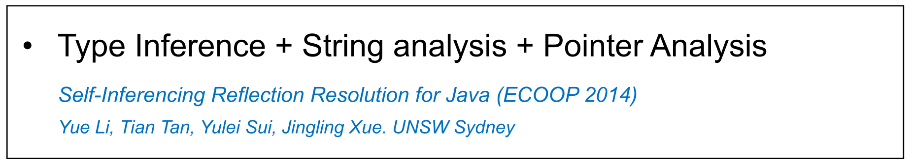

这来源于一个巧妙的观察：

>   When string arguments cannot be resolved statically, **infer the reflective targets at their usage points**!

getClass获得Class的Metaobject。

这里的cmd是动态的命令，静态时无法分析……

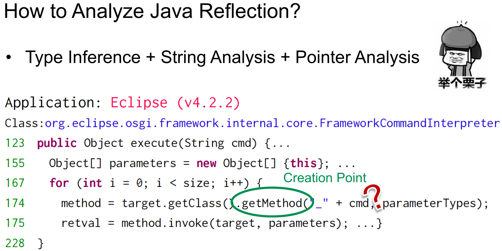

但是！在篮圈处的调用中，由于只传入parameter这一个参数，而在155行我们已经知道其类型就是``FrameworkCommandInterpreter`（或其子类/父类）。

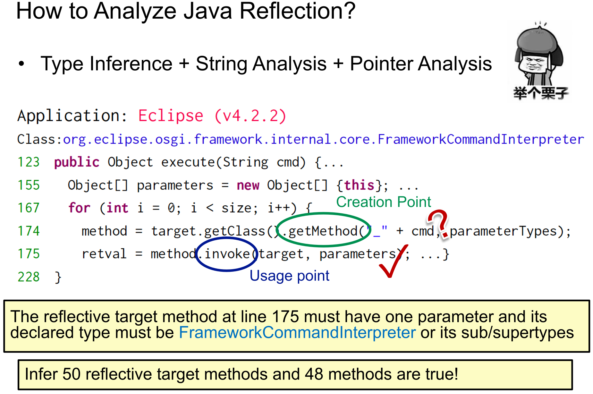

此外也有和动态分析结合的方法：

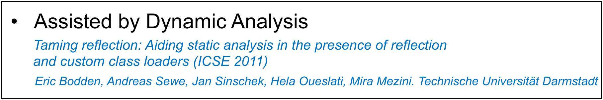

# Hard Language Feature: Native Code

## Native Code

在Java中，一句简单的`println`最后会调用**与底层平台相关的C或C++代码**，这些代码就称为Native Code。Java也借此实现了 `Run anywhere`的目标。

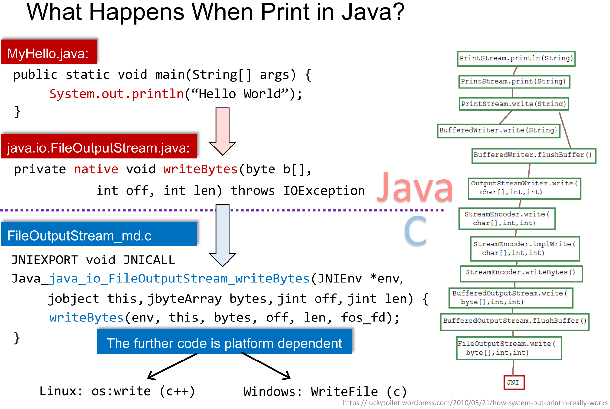

### Java Native Interface(JNI)

JNI允许JVM与Native Code写出的Native Lib交互。进而提供与OS交互、提高性能和代码复用（指在Java中使用别的C/C++编写的libraries）的功能。

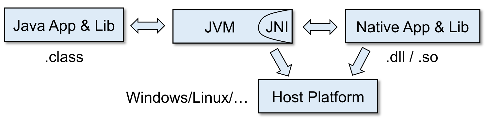

## Why Native Code is Hard

为了使用Native Library中的一个Method，需要经过这些步骤：

1.  用C/C++按照标准写一个库并编译生成`*.so`文件
2.  在Java中加载Native Library
3.  在Java中声明Native Method
4.  调用Native Method

然而：

1.  类似的JNI可提供的操作有230种（在2020年如此）
2.  由此引出紫框中的问题：`如何分析Native Call？`

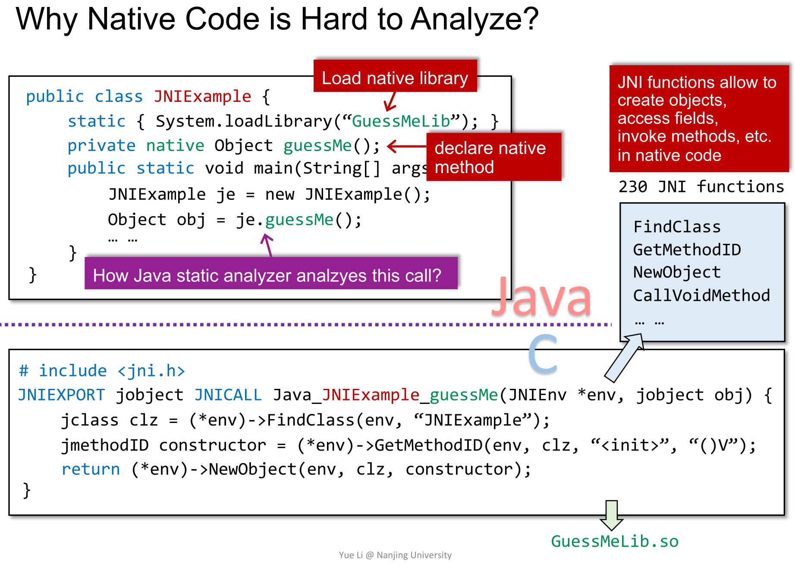

### Current Practice & More

接下来介绍一个现有的解决方法，然后给新的拓展阅读方向。~~对，本次讲的都是前沿内容。~~

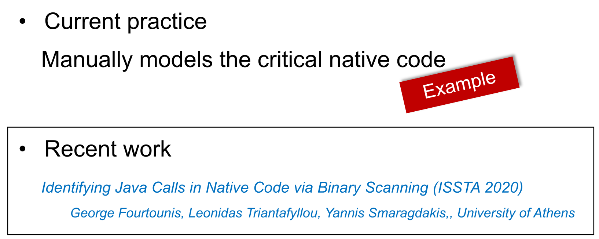

arraycopy(src,3,dest,4,5)就是从src的第三个元素起，拷贝起始位置是dest的第四个元素，总共拷贝5个元素。

如果不分析Native Code，我们就会失去很多信息。而Modeling的分析方法是：

-   先将其副作用用Java代码表示出来（图中第一个方框）
-   然后用指针分析的方法进一步抽象其副作用（图中第二个方框）

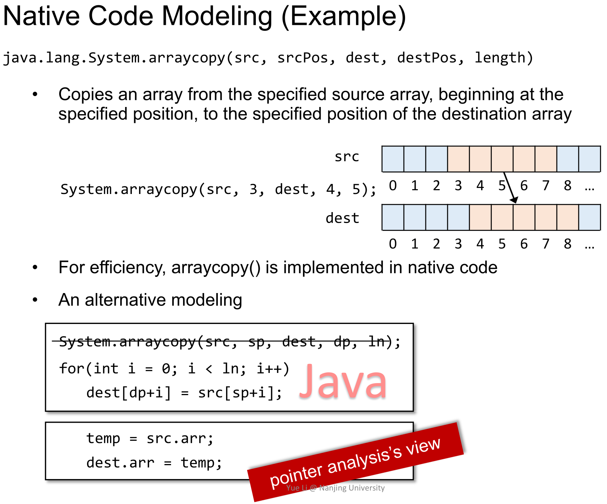

如果对Soundiness感兴趣，推荐网站http://soundiness.org

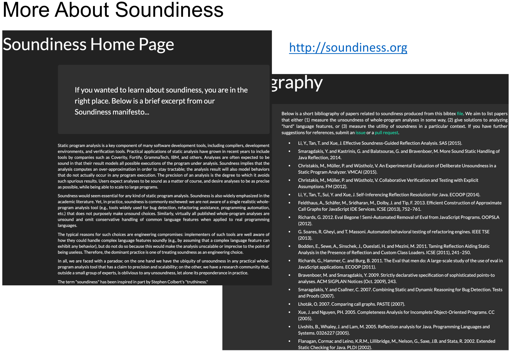

# Key Points

-   Understand **soundiness: its motivation and concept**
-   Understand why **Java reflection and native** code are hard to analyze
