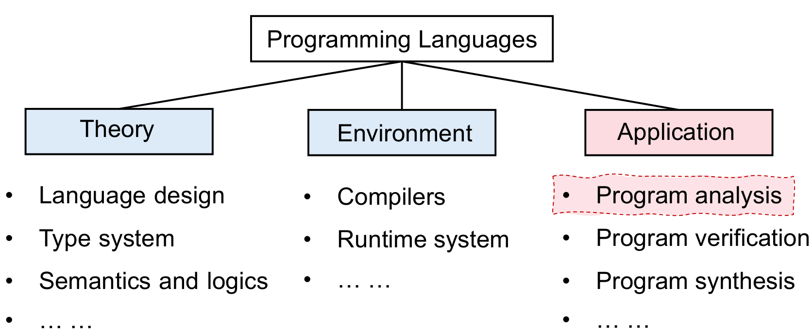

# 为什么你需要了解静态程序分析

## 定位

**静态程序分析**是**编程语言**中**应用**层面下的一个细分领域。

（TODO：举一些具体的例子）

当今编程语言可以主要分为三大类
-   命令式（C、C++、JAVA）
-   函数式（Scale、Haskell）
-   逻辑式（Prolog、SQL）

*之后的内容主要关注于针对命令式语言的分析。*

当今**编程语言**这个分支下，面临这样一条恶龙：`数十年来语言的核心没有变化，但软件的规模和复杂性增长迅速，如何保证程序的可靠性？`

## 应用

静态程序分析即是屠龙的宝刀之一，掌握并应用这一技术，能够：

1. 提高程序可靠性——Null pointer dereference, memory leak, etc.（空指针引用与内存泄漏等） 
2. 提高程序安全性——Private information leak, injection attack, etc.（隐私信息泄漏与注入攻击等）
3. 为编译优化提供基础技术——Dead code elimination, code motion, etc.（死代码消除和代码向循环外移动等）
4. 有助于程序理解——IDE call hierarchy, type indication, etc.（为集成开发环境的功能提供帮助）

## 市场

在学术界，静态程序分析技术几乎可以应用于所有关于程序的研究方向。

在工业界，国外的Google，IBM等大企业已经初步建立了自己的静态程序分析团队。国内的华为和阿里等企业也正在寻找静态程序分析方面的人才。

（TODO：添加更为详细的例子）